# Blender 大型 3D 动画生产管线指南

> **适用范围**：以 Blender 为核心 DCC，制作时长从十几分钟到长片级别的 3D 动画；适用于个人、小团队，也可作为中型团队的管线蓝本。
> **Blender 版本**：本文以 **Blender 5.2 LTS** 为基准，项目开始时锁定该版本，**项目中途不升级**。附录 A 列出的特性均已包含在 5.2 LTS 中。
> **原版**：`dls.orig.md`（对话式初稿）。本版与原版的主要差异见附录 B。
> **图表**：流程图和架构图使用 Mermaid 绘制，请在支持 Mermaid 的环境中查看（GitHub、GitLab、Obsidian、Typora、VS Code 的 Markdown Preview Mermaid 插件等）。目录树、命名规则和公式仍然用文本表示。

---

## 目录

1. [管线总览](#1-管线总览)
2. [项目规格（Project Bible）](#2-项目规格project-bible)
3. [目录结构、命名与文件组织](#3-目录结构命名与文件组织)
4. [前期制作](#4-前期制作)
5. [资产制作](#5-资产制作)
6. [镜头制作](#6-镜头制作)
7. [渲染](#7-渲染)
8. [后期制作](#8-后期制作)
9. [交付与归档](#9-交付与归档)
10. [生产管理：审阅、版本与协作](#10-生产管理审阅版本与协作)
11. [性能与场景规模控制](#11-性能与场景规模控制)
12. [推荐工具栈](#12-推荐工具栈)
13. [个人 / 小团队策略与规模评估](#13-个人--小团队策略与规模评估)
14. [Python 自动化与 AI Agent](#14-python-自动化与-ai-agent)
15. [落地清单：项目模板](#15-落地清单项目模板)
- [附录 A：Blender 特性与版本对应](#附录-ablender-特性与版本对应)
- [附录 B：相对原版的修订说明](#附录-b相对原版的修订说明)

---

## 1. 管线总览

大型动画管线**不是一条单线**，而是三个阶段，每个阶段内部有多条并行轨道：

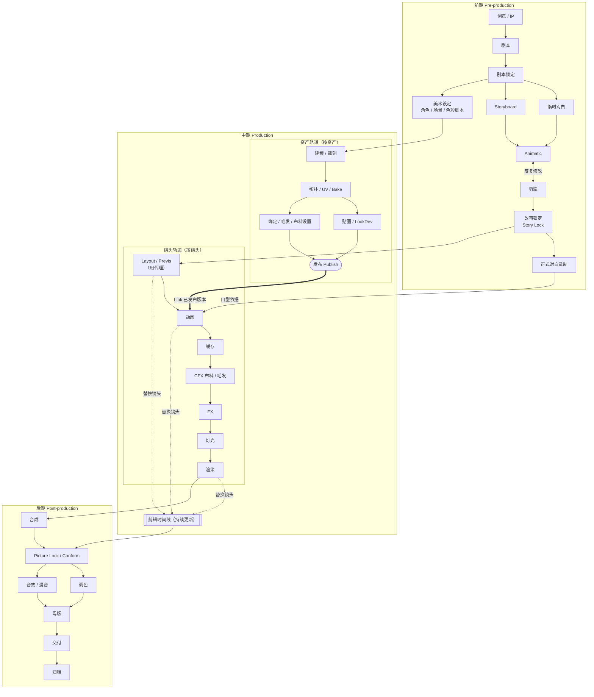

> 前期、中期、后期不是严格串行：资产轨道在美术设定后即可开工，Layout 在故事锁定后用代理开工，剪辑时间线从 Animatic 一直延续到 Picture Lock。

下面是一个 10 分钟短片（小团队）的**示意排期**，只用来说明各环节的重叠关系，不代表工期承诺：

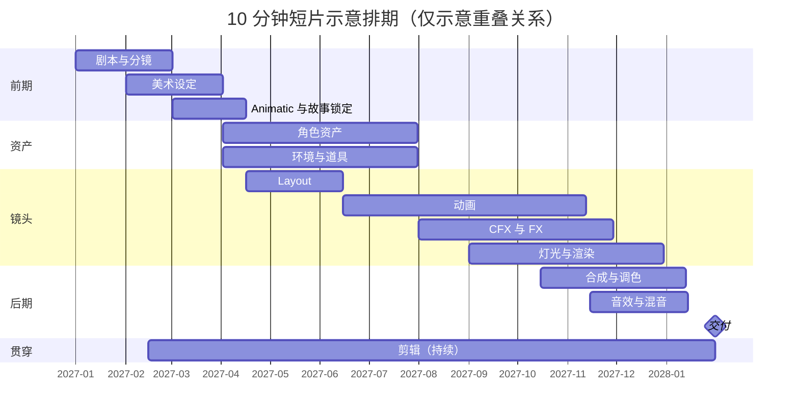

几条关键原则：

| 原则 | 说明 |
|---|---|
| **镜头（Shot）是生产的最小管理单位** | 排期、审阅、渲染、交付都以镜头为单位 |
| **Layout 和资产制作并行** | Layout 使用代理或粗模尽早开工，不必等资产全部完成 |
| **对白先于动画** | 口型动画依赖正式（或至少临时）的对白音轨 |
| **剪辑贯穿始终** | 从 Animatic 开始，每一版产出都替换回剪辑时间线 |
| **资产发布后才能被镜头引用** | WIP 和 Publish 分离，镜头只 Link 已发布的版本 |
| **所有模拟都要缓存** | 下游环节只读缓存，不在打开文件时重算 |

> **结论先行**：Blender 本身足以完成一整部 3D 动画。2024 年的长片《Flow》全程使用 Blender 制作并用 Eevee 渲染，获得了奥斯卡最佳动画长片。大型项目真正的瓶颈通常**不是缺功能**，而是**规格统一、资产管理、文件组织、缓存、渲染调度和协作**，也就是本文的大部分内容。

---

## 2. 项目规格（Project Bible）

**在打开 Blender 之前**先写好下面这份规格，项目中途改规格的代价极高。

### 2.1 技术规格

| 项目 | 建议值 / 示例 | 说明 |
|---|---|---|
| Blender 版本 | **5.2 LTS** | 所有成员、所有渲染节点使用同一版本 |
| 分辨率 | 1920×1080 或 3840×2160 | 长片院线可用 DCI 2K（2048×858 Scope / 1998×1080 Flat） |
| 画幅比 | 16:9 / 1.85:1 / 2.39:1 | 决定构图，Layout 阶段就要启用画幅遮罩 |
| 帧率 | 24 fps | 一旦定下不可更改 |
| 场景单位 | 公制，1 unit = 1 m | 影响模拟、景深、灯光衰减 |
| 帧号约定 | 镜头从 **1001** 开始，前后各留 **8 帧 handles** | 例：有效帧 1009–1128，实际渲染 1001–1136 |
| 色彩管理 | 见 2.2 | |
| 渲染输出 | EXR 规格见 7.4 | |

### 2.2 色彩管理

只讲"Linear EXR"而不讲色彩管理，相当于没有讲。需要统一：

| 环节 | 建议 |
|---|---|
| 工作色彩空间 | 场景线性（Linear Rec.709 / Linear sRGB）；跨软件协作可考虑 ACEScg |
| 显示变换 | **AgX**（Blender 4.0 起为默认）或 Filmic；全项目统一，不允许个人随意切换 |
| 贴图色彩空间 | Base Color 用 sRGB；Roughness、Metallic、Normal、Displacement 等数据贴图用 **Non-Color** |
| 渲染输出 | EXR 保存场景线性数据，**不烘入**显示变换 |
| 交付色域 | 网络和电视用 Rec.709（Gamma 2.4）；院线用 DCI-P3；HDR 另行规划 |
| 配置 | 如需 ACES，使用统一的 OCIO 配置，通过环境变量 `OCIO` 分发给所有机器 |

### 2.3 命名规范

| 类别 | 规则 | 示例 |
|---|---|---|
| 资产 | `<类型>_<名称>_<变体>` | `chr_hero_default` / `prp_car01_damaged` |
| 镜头 | `seq<三位>_sh<三位>` | `seq010_sh020` |
| 文件 | `<镜头或资产>_<环节>_v<三位>.blend` | `seq010_sh020_anim_v012.blend` |
| 渲染帧 | `<镜头>_<环节>_v<三位>.<四位帧号>.exr` | `seq010_sh020_light_v003.1001.exr` |
| 对象 | 用前缀区分用途 | `GEO_` / `RIG_` / `CTRL_` / `DEF_` / `MCH_` / `CAM_` / `LGT_` |

资产类型前缀：`chr` 角色、`env` 环境、`prp` 道具、`veh` 载具、`fx` 特效。

**禁止**使用 `final`、`final2`、`new` 这类名字。"定稿"是审批状态，不是文件名（见 10.1）。

---

## 3. 目录结构、命名与文件组织

### 3.1 统一目录结构

全项目**只用一套**目录结构。镜头相关的动画、FX、灯光文件都放在镜头目录下，不另开按环节划分的顶层目录：

```text
MyMovie/
├── 00_project/          # Project Bible、OCIO 配置、管线脚本、模板 .blend
│   ├── bible/
│   ├── ocio/
│   ├── pipeline/        # Python 管线代码（纳入 Git）
│   └── templates/
├── 01_story/            # 剧本、色彩脚本
├── 02_storyboard/
├── 03_editorial/        # 剪辑工程、Animatic、EDL / OTIO
├── 04_audio/            # 对白（临时/正式）、音效、音乐、混音工程
├── 05_assets/
│   ├── chr/  hero/
│   │         ├── wip/       # 工作文件，可随意迭代
│   │         └── publish/   # 已发布版本，只读，镜头只引用这里
│   ├── env/
│   ├── prp/
│   ├── veh/
│   ├── fx/              # 可发布 FX 预设（与 chr/env/prp/veh/lib 平级）
│   └── lib/             # 共享材质、HDRI、节点组、GN 生成器
├── 06_shots/
│   └── seq010/
│       └── sh010/
│           ├── layout/  anim/  cfx/  fx/  light/  comp/
│           ├── cache/   # abc / usd / vdb / 点缓存
│           └── render/  # 按 环节/版本 分目录的 EXR 序列
├── 07_review/           # 审阅用的 MP4 / 拼接片
├── 08_delivery/
└── 09_archive/
```

### 3.2 按环节拆分 .blend

不要把整部片子塞进一个 `movie.blend`。每个环节一个文件，下游通过 **Link** 引用上游：

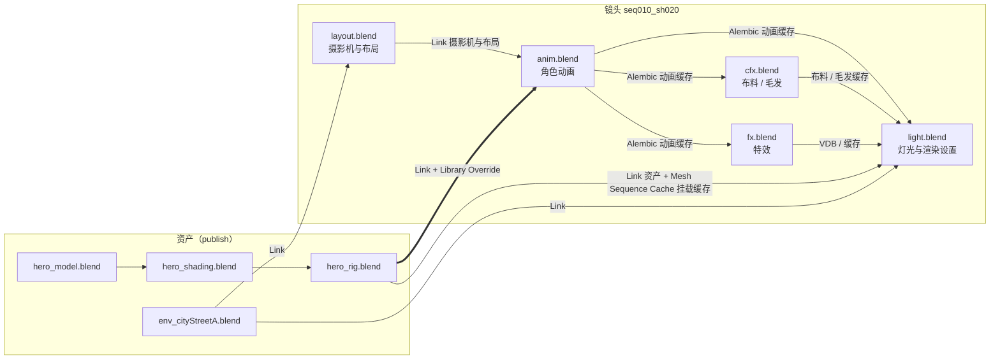

各文件的职责：

| 文件 | 输入 | 输出 |
|---|---|---|
| `layout` | 场景、代理角色 | 摄影机动画、布局、帧范围 |
| `anim` | Layout、角色绑定（Override） | 角色动画缓存 |
| `cfx` | 动画缓存、布料和毛发设置 | 布料 / 毛发缓存 |
| `fx` | 动画缓存、场景 | VDB 等特效缓存 |
| `light` | 所有缓存、场景、带材质的资产 | 渲染设置、EXR |

### 3.3 Link 与 Library Override

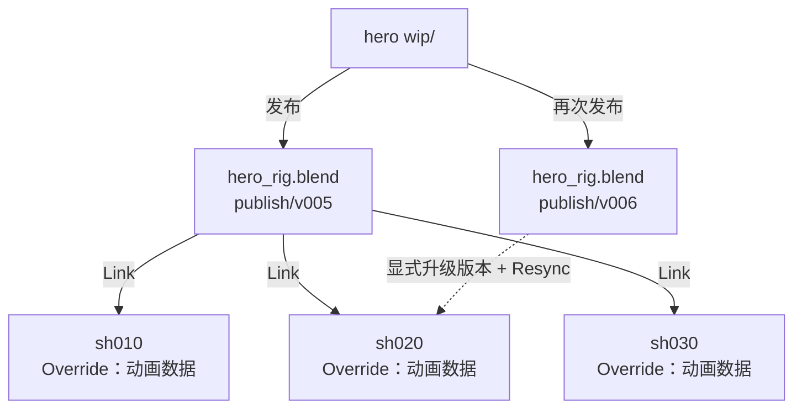

- **Link**：资产修改并重新发布后，所有镜头都能同步更新。
- **Library Override**：镜头需要在本地修改的部分（动画、少量属性）通过 Override 实现，**不改动资产源文件**。
- **注意事项**：
  - 资产的层级结构（骨骼名、Collection 结构）发布后要保持稳定，否则 Override 在 **Resync** 时会出错或丢失数据。
  - 旧的 **Proxy 系统已在 Blender 3.x 中移除**，由 Library Override 取代。本文提到"代理"时，只指低模替身，和这个旧系统无关。
  - 镜头文件引用 `publish/` 下的**固定版本**，或者一个受控的 `latest` 链接；升级资产版本要作为显式操作来做。

### 3.4 Asset Browser

建立项目自己的资产库（Asset Library 指向 `05_assets/` 下的发布目录），分类建议：Characters、Environment、Props、Vehicles、FX、Materials、Node Groups、HDRI、Poses。

搭建新镜头时，从 Asset Browser 拖入角色、场景和道具，再配合管线脚本自动完成 Link、Override 和命名。

---

## 4. 前期制作

### 4.1 剧本


- 剧本要定稿锁定（Script Lock）。之后的改动要走变更流程，并评估对已完成镜头的影响。
- 按场次拆成 **Sequence**，再在分镜阶段拆成 **Shot**。10 分钟短片的示例：

| Sequence | 内容 | 预计镜头数 |
|---|---|---|
| SEQ010 | 城市开场 | 6 |
| SEQ020 | 主角家 | 10 |
| SEQ030 | 街道 | 8 |
| SEQ040 | 追逐 | 20 |
| SEQ050 | 战斗 | 25 |
| SEQ060 | 结尾 | 6 |

### 4.2 对白录制

- **临时对白（Scratch）**：Animatic 阶段自己录或用 TTS，用来定节奏。
- **正式对白**：**必须在正式动画开始前完成**，因为口型和表演都以它为准。
- 对白按镜头切分并命名（`seq010_sh020_hero_line03.wav`），放到 `04_audio/dialogue/`。

### 4.3 Storyboard

工具不限：手绘、Krita、Photoshop、Blender Grease Pencil（推荐用它的 Storyboard 模板）、AI 草图、简单 3D 方块都可以。

每格分镜至少要标明：

- 镜头编号
- 景别（Wide / Medium / Close-up）
- 机位与运动
- 人物位置与动作
- 对白
- 预计时长

### 4.4 Animatic 与剪辑

把分镜配上临时对白、临时音乐和时长，剪成可以播放的片子。

- 目的：在花钱花时间之前发现"这场戏很无聊"或"节奏不对"。
- 可以在 Blender 的 VSE 或 DaVinci Resolve 里剪。
- **故事锁定（Story Lock）**：Animatic 通过后，镜头列表和每个镜头的时长基本固定，这是后续所有排期的基础。
- 输出镜头清单（Shot List），作为镜头数据库的初始数据：

| 镜头 | 剪辑时码 | 有效帧 | 角色 | 场景 | 道具 | FX | 灯光方案 |
|---|---|---|---|---|---|---|---|
| seq010_sh020 | 00:12–00:17 | 1009–1128 | Hero, Enemy | env_cityStreetA | Car01, StreetLamp | Smoke, Dust | Night_Rain |

### 4.5 美术设定

- 角色设定图：正面、侧面、背面、表情表、服装、配色、身高比例对照。
- 场景设定、道具设定。
- **色彩脚本（Color Script）**：整部片每个段落的主色调和情绪。它是后面灯光和调色的依据。

---

## 5. 资产制作

### 5.1 角色资产流程

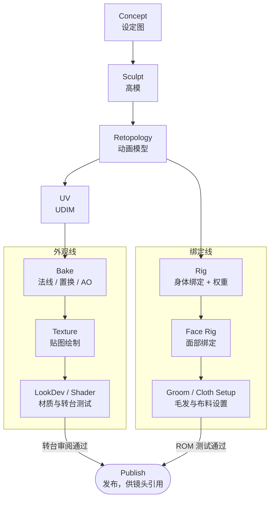

拓扑确定之后，**外观线和绑定线可以并行推进**。前提是动画模型的拓扑在这之后不再改动，否则权重、Shape Keys 和 UV 都要返工。

#### 5.1.1 Sculpt

Sculpt Mode：从 Base Mesh 开始，结合 Multires 或 Dyntopo 雕刻，产出高模。雕刻内容包括肌肉、面部、手、服装和皱褶细节。

#### 5.1.2 Retopology

雕刻模型（常达数百万到上千万面）不能直接用于动画，要重建拓扑：

| | 面数量级（参考） |
|---|---|
| 雕刻高模 | 5M – 20M |
| 动画模型（Cage） | 2 万 – 8 万；渲染时再加 Subdivision Surface |

布线的重点区域决定了变形质量：

| 区域 | 要求 |
|---|---|
| 眼、嘴 | 环形布线（Edge Loop），支持睁闭眼和张嘴 |
| 鼻唇沟、脸颊 | 顺着表情肌走向 |
| 肩 | 布线要能支撑手臂大角度抬起，避免塌陷 |
| 肘、膝 | 关节处至少 3 圈环线，内侧留出挤压的空间 |
| 手指 | 每个关节 3 圈环线 |

工具：Blender 自带的 Snap / Shrinkwrap / PolyBuild；插件有 RetopoFlow；Quad Remesher（付费）适合道具和次要角色。

#### 5.1.3 UV

- 按部位拆分：Body / Face / Clothes / Shoes / Accessories。
- 大型项目使用 **UDIM**（1001、1002、1003……，Blender 2.92 起支持），不要把整个角色压缩进一张 2K 贴图。
- 全项目统一 **Texel Density**，例如主角面部 20 px/cm。

#### 5.1.4 Bake

把高模细节转移到动画模型上：

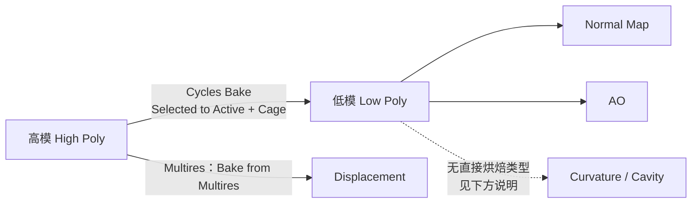

- Normal 和 AO 可以直接用 Cycles Bake 烘焙。
- Displacement：高模是 Multires 时，可以用 Bake from Multires；也可以把高度信息输出成 Emission 再烘焙。
- Curvature / Cavity：Blender 没有直接的烘焙类型。可以把 Geometry 节点的 Pointiness（或 GN 计算的曲率属性）接到 Emission 上再烘焙，也可以在 Substance 3D Painter 中生成。
- 近景主角可以用 **Displacement + Adaptive Subdivision**（Cycles 实验特性），在渲染时恢复细节。
- Curvature 和 AO 贴图可以作为贴图绘制的遮罩。

#### 5.1.5 Texture

| 方式 | 工具 |
|---|---|
| 纯 Blender | Texture Paint + 程序化节点 + Bake 遮罩 |
| 行业常用 | Substance 3D Painter（原生支持 UDIM） |
| 开源替代 | ArmorPaint |

注意贴图的色彩空间（见 2.2）。

#### 5.1.6 LookDev / Shader

在统一的 **LookDev 场景**里调材质：固定的 HDRI、固定灯光、中性灰球、色卡、转台相机。

Principled BSDF 的输入是**并列**的，不是串联的：

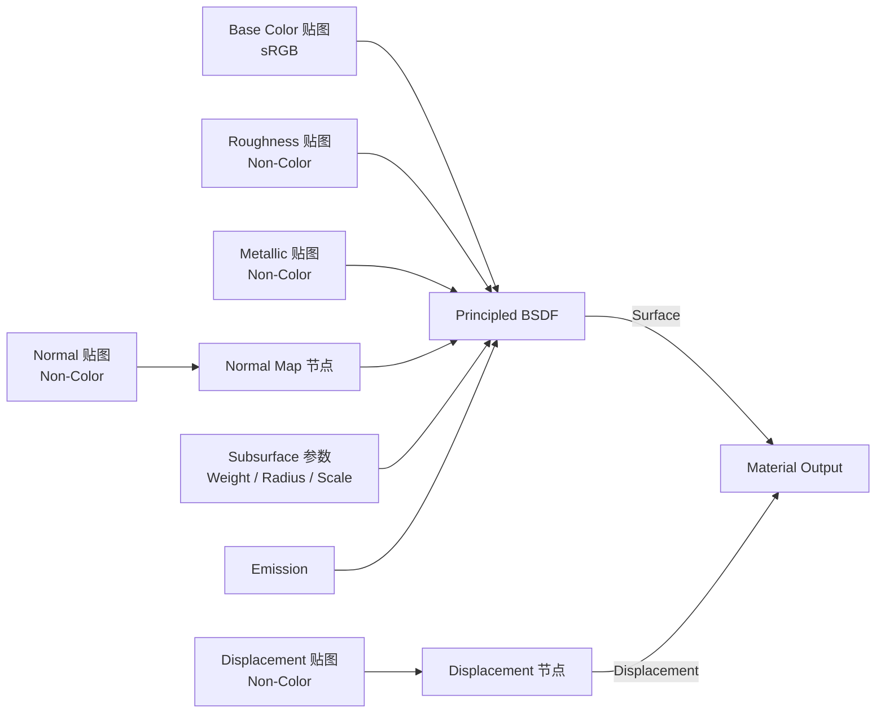

皮肤要点：Subsurface 使用 Random Walk；Radius 按红、绿、蓝区分（红色最大）；Scale 必须和场景单位匹配（1 unit = 1 m）。

交付标准：角色在 LookDev 场景下的转台渲染通过审阅之后，才能发布。

#### 5.1.7 身体绑定

建议从 **Rigify**（Blender 自带）开始，复杂需求再考虑 Auto-Rig Pro（付费）或自研。

骨骼分层（Rigify 的约定）：

| 前缀 | 用途 |
|---|---|
| `DEF-` | 变形骨，蒙皮权重只绑在这些骨骼上 |
| `ORG-` | 原始参考骨 |
| `MCH-` | 机制骨（约束、中间计算） |
| 无前缀 / `CTRL` | 动画师操作的控制器 |

基础层级：

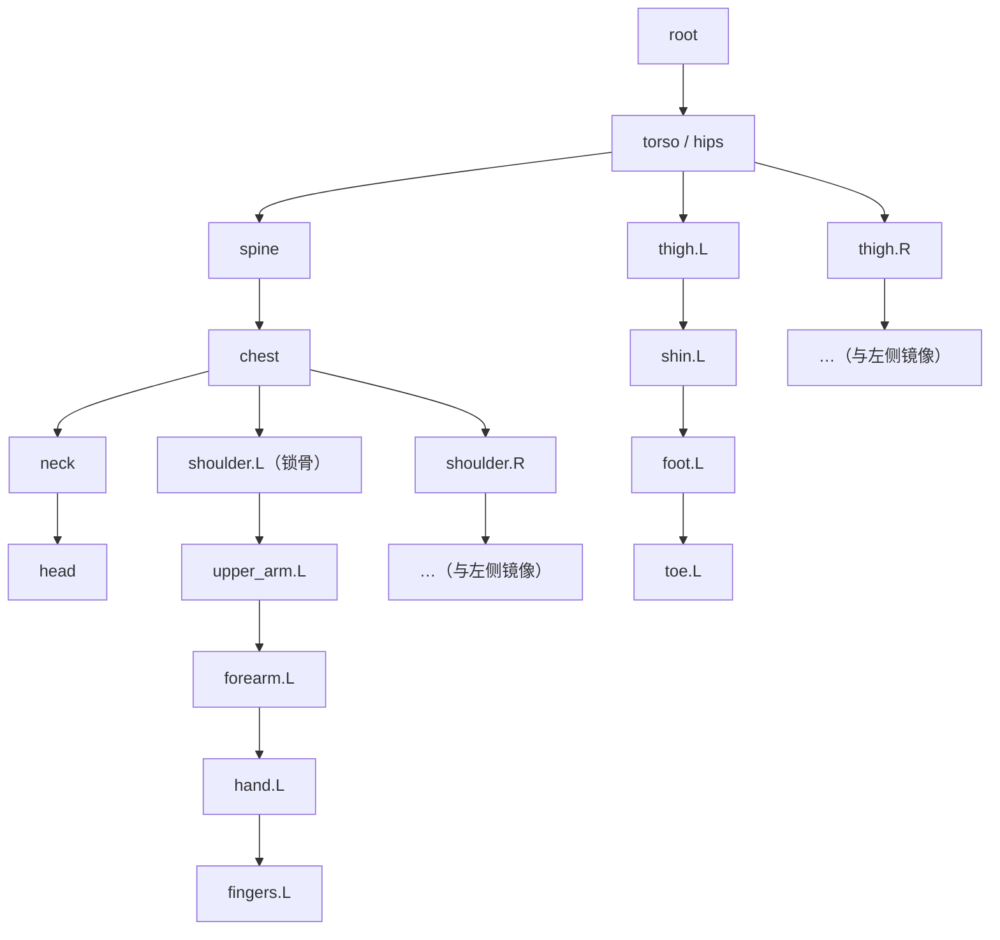

需要具备：IK/FK 切换与对齐（Snap）、Pole Target、空间切换（Space Switch）、Drivers、Custom Properties、Bone Collections 分组。

权重与变形质量：

- 在关节处做 **Corrective Shape Keys**（由骨骼角度驱动），修正肘、膝、肩的变形。
- 准备一段 **ROM（Range of Motion）测试动画**，每次修改绑定后都跑一遍，检查变形。

#### 5.1.8 面部绑定

| 方式 | 优点 | 缺点 |
|---|---|---|
| Shape Keys（形态键） | 形状精确，适合风格化 | 组合表情需要大量 Corrective |
| 骨骼（Rigify Face） | 灵活，便于组合 | 需要精细权重 |
| 混合（推荐） | 骨骼负责大动作，Shape Key 负责细节修正 | 搭建成本高 |

- 基础表情：Blink、Smile、Frown、OpenMouth、Angry、Sad、Surprised……
- **口型集（Visemes）**：A/I、E、O、U、M/B/P、F/V、L、W/Q 等，是对白动画的基础。
- 控制层：面板式控制器（2D Face UI）或贴在脸上的控制器，经 Driver 驱动 Shape Keys 和骨骼。
- 眼睛：眼球旋转、上下眼睑跟随、瞳孔缩放、高光控制。

#### 5.1.9 毛发与布料的资产级设置

- **毛发**：使用 Hair Curves（3.3 起的新系统）配合 Geometry Nodes 毛发节点做造型（Groom）。按镜头距离准备多个档次：

| 档次 | 用途 | 形式 |
|---|---|---|
| Hero | 近景 | 完整 Curves，高密度 |
| Mid | 中景 | 降低密度、加粗 |
| BG | 远景、群集 | Hair Cards 或贴图 |

- **布料**：在资产里就设置好仿真网格（通常比渲染网格更低模）、Pin Group、碰撞体、布料参数预设，镜头环节只负责运行和缓存。

### 5.2 环境资产

**不要**在一个 .blend 文件里把整座城市全部建完。按区块拆分，再组合：

```text
env_city/
├── building_lib.blend   # 模块化建筑件
├── block_A.blend
├── block_B.blend
├── street_A.blend
├── street_B.blend
└── city_master.blend    # 只做 Link 和布局
```

文件之间的引用关系：

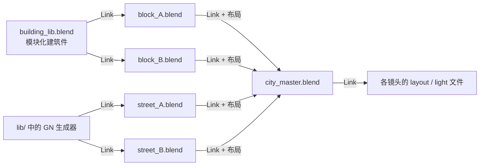

组合手段：Collection Instance、Asset Browser、Linked Data、Library Override、Geometry Nodes。

#### 5.2.1 程序化生成（Geometry Nodes）

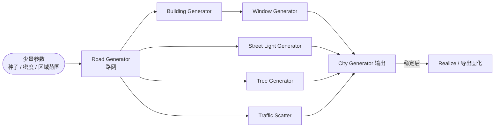

路网决定了其他所有生成器的摆放位置，所以它是整个生成器的起点，其余生成器都沿着路网布置。

- 生成器封装成节点组放进 `05_assets/lib/`，作为共享资产。
- 生成结果**稳定之后要固化**（Realize，或导出为缓存或静态资产），防止镜头里因为参数被误改而跳变。

#### 5.2.2 植被散布

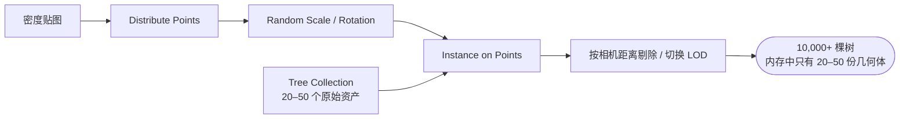

植被资产库可以直接使用 Poly Haven、Quixel Megascans、Botaniq 等。

### 5.3 道具与载具

流程和角色相同，简化版：建模 → UV → 贴图 → LookDev → （需要动的做简单绑定）→ 发布。可动部件（车门、车轮）的枢轴点和骨骼要在资产阶段设置好。

### 5.4 发布（Publish）

每个资产从 `wip/` 发布到 `publish/v###/` 时，自动执行检查：

- 命名规范、无未应用的缩放（Scale = 1）、无多余数据块。
- 贴图路径为相对路径，且都在项目目录内。
- 绑定通过 ROM 测试，材质通过 LookDev 转台审阅。
- 写入元数据：版本号、作者、时间、变更说明。

---

## 6. 镜头制作

每个镜头都要走的核心循环：

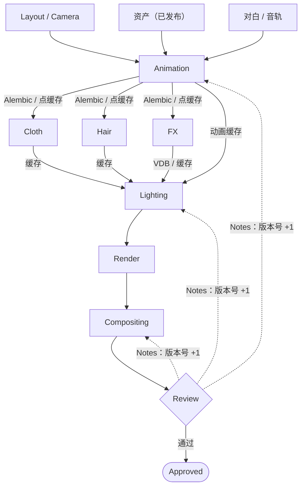

图中只画了最终审阅。实际上每个环节交付下游之前都要单独送审（动画见 6.2）。

### 6.1 Layout 与摄影机

Layout 在 Animatic 之后立刻开始，**使用代理或粗模**，与资产制作并行推进：

- 放置角色、场景、道具和摄影机，确定构图、机位、镜头运动、比例和粗略走位（Blocking）。
- 产出：摄影机动画（锁定后交给动画环节）、镜头的真实帧范围、场景布局。
- 替换回剪辑时间线，替代 Animatic 中对应的镜头。

摄影机参数：

| 参数 | 说明 |
|---|---|
| Focal Length | 24 mm 空间感和环境感强；35/50 mm 接近人眼；85 mm 人物肖像感；135 mm 压缩空间 |
| Sensor | 全项目统一（如 36 mm Full Frame 或 Super 35），否则焦距的含义会变 |
| Depth of Field | 焦点距离可以绑定到对焦目标（Focus Object） |
| Motion Blur | 快门角度统一，通常为 180°（Blender 中 Shutter = 0.5） |
| Camera Shake | 手持感用程序化或实拍抖动数据，统一做成可复用资产 |

### 6.2 动画

分阶段推进，每个阶段都送审：

| 阶段 | 内容 | 审阅关注点 |
|---|---|---|
| Blocking | 关键姿势（Pose to Pose），常用 Constant 插值 | 表演、构图、节奏 |
| Blocking Plus | 加细分帧（Breakdowns） | 动作逻辑 |
| Spline | 切换为 Bezier 插值，调整 Timing、Spacing、Arcs、Overlap、Follow Through | 流畅度 |
| Polish | 手指、眼神、呼吸、微表情、衣服和头发的次级动作 | 细节 |

要点：

- **对白镜头**：先做口型（Visemes），再做表情和身体表演。
- **参考视频**：动画师自己拍摄表演参考，放进镜头目录。
- **动作捕捉**：可以用 Rokoko、Xsens，或者视频动捕（AI 单目动捕）作为动画起点，再手动修整。个人和小团队可以靠它大幅提效。
- 使用 **Action / NLA** 管理可复用的循环动作（走、跑、待机）。
- 动画环节**不做**布料和毛发模拟，只交付干净的角色动画。

### 6.3 缓存

大型项目不能让所有内容在打开文件时实时计算。环节之间一律通过缓存交接：

| 数据 | 格式 | 说明 |
|---|---|---|
| 角色 / 道具动画 | **Alembic (.abc)** 或 USD | 下游读取变形网格，不依赖绑定 |
| 布料、软体 | Alembic / 点缓存 | |
| 毛发 | Alembic（Curves）/ 内部缓存 | |
| 烟、火、体积 | **OpenVDB (.vdb)** | |
| 液体 | 网格序列 / Alembic | |
| GN 模拟 | Bake 到磁盘 | 4.0 起的 Simulation Zone 可以 Bake |

关于 **USD**：Blender 支持 USD 的导入和导出，但层级合成（Layering / Composition）能力远弱于 Houdini Solaris 等工具。纯 Blender 管线以 **Link + Alembic** 为主；跨软件协作（例如 FX 交给 Houdini）时用 USD 或 Alembic 交换。

缓存路径规范：`06_shots/seq010/sh020/cache/<环节>/v###/`，版本号和生成它的源文件版本保持对应。

### 6.4 布料（CFX）

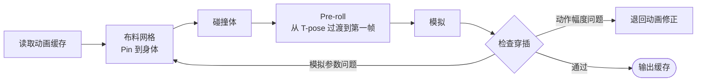

- 角色动画从 1001 帧之前留出 **Pre-roll** 帧（例如从 950 帧开始），让布料先落到位。
- 适用对象：裙子、外套、披风、床单、旗帜。
- 大幅度动作导致的穿插，先在动画里修，再在模拟里修，不要靠后期遮挡。

### 6.5 毛发

- 近景使用 Hero 档 Curves，配合 Geometry Nodes 做动力学或跟随，并缓存。
- 中景和远景用低档毛发，或者只做刚性跟随、不做模拟。
- 同一画面有几十上百个角色时，必须使用 BG 档，否则内存和渲染时间都会失控。

### 6.6 特效（FX）

| 类型 | Blender 方案 | 说明 |
|---|---|---|
| 烟、火 | Mantaflow Gas | 中小规模可用；大规模解算慢，而且 Mantaflow 基本已停止开发 |
| 液体 | Mantaflow Liquid / Ocean Modifier（海面） | 大规模水体建议用 Houdini |
| 爆炸、破碎 | Rigid Body + Cell Fracture 插件 | 复杂破碎可用 Houdini RBD |
| 雨、雪、灰尘、碎屑、魔法 | **Geometry Nodes（含 Simulation Zone）** / 粒子系统 | 首选 GN，可控性和性能更好 |
| 体积雾 | 体积材质 / VDB | |

FX 按类型做成可复用的预设或节点组。**可发布的 FX 预设放 `05_assets/fx/`**；节点组与 GN 生成器放 `05_assets/lib/`。镜头里只调参数并缓存。

### 6.7 群集（Crowd）

同一镜头里有大量角色时：

- 准备少量角色变体（换装、换色），配合循环动作库。
- 用 Geometry Nodes 把角色（Collection Instance 或 Alembic 缓存）散布到点上，并随机偏移动作起始帧。
- 远景角色可以使用 Billboard（面片）。
- 复杂群集行为可以使用插件（如 CrowdMaster 类工具），或在 Houdini、Unreal 中完成。

### 6.8 灯光

灯光文件只负责灯光和渲染设置，所有几何体和动画都通过 Link 和缓存读入。

搭建顺序（按层叠加，不是串联的因果关系）：

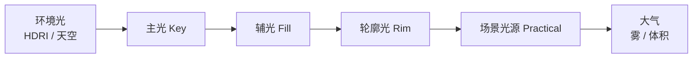

示例（夜晚雨中城市），以及灯光模板如何在镜头之间共享：

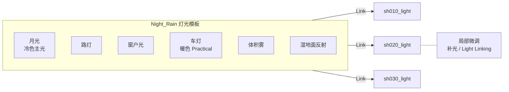

- **按段落建立灯光模板（Light Rig）**：同一场戏的所有镜头共享一套灯光，只做局部微调，保证镜头之间的连续性。
- 对照色彩脚本和关键帧概念图（Key Art）调整。
- 使用 **Light Linking**（Cycles 4.0 起）给角色单独补光。

---

## 7. 渲染

### 7.1 渲染器选择

| | Cycles | Eevee（4.2 起为 Eevee Next） |
|---|---|---|
| 原理 | 路径追踪 | 光栅化 + 光线追踪混合 |
| 适合 | 写实、复杂光照、焦散、高质量体积 | 风格化、快速迭代、渲染预算紧张 |
| 单帧耗时 | 分钟到小时级 | 秒到分钟级 |
| 案例 | 多数 Blender 开放电影 | 长片《Flow》 |

**选择依据是渲染预算（见 7.5）**，不能只凭"电影级就选 Cycles"的直觉。

### 7.2 分层渲染（View Layers）

用 View Layer 把画面拆开渲染，后期组合，局部修改时只重渲一层：

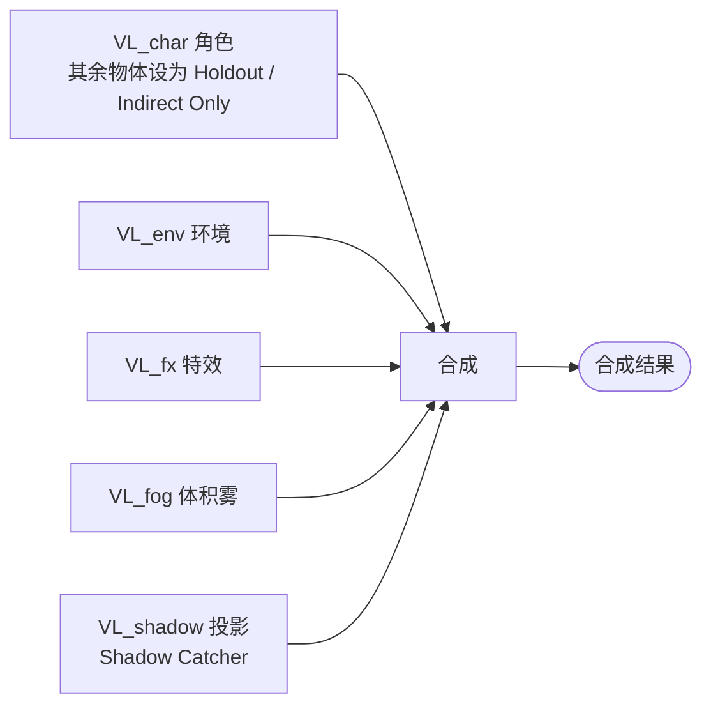

改了角色的表演，只需要重渲 `VL_char` 和 `VL_shadow`；环境和雾不用动。

### 7.3 Render Passes

| Pass | 用途 | 说明 |
|---|---|---|
| Combined（Beauty） | 主画面 | |
| Diffuse / Glossy / Transmission（Direct / Indirect / Color） | 分别调整漫反射和反射 | |
| Emission / Environment / Volume | 自发光、环境、体积 | |
| Shadow Catcher | 投影合成 | **Cycles 3.0 起已去掉旧的 Shadow Pass**，改用 Shadow Catcher |
| Depth（Z）/ Mist | 景深、雾 | |
| Normal / Position | 重打光（Relight） | |
| **Cryptomatte**（Object / Material / Asset） | 精确遮罩 | 后期选取任意物体 |
| Vector | 后期运动模糊 | **开启渲染运动模糊时无法输出**，二者选一 |
| Denoising Data | 后期降噪 | |

这样后期可以单独调整角色、背景、灯光、反射、阴影和雾，而**不必重新渲染整个镜头**。

### 7.4 EXR 输出规格

| 项目 | 建议 |
|---|---|
| 格式 | **OpenEXR Multilayer**（所有 Pass 和 View Layer 放在一个文件里） |
| 位深 | 颜色类 Pass 用 **16-bit Half Float**；Depth / Position / Vector / Cryptomatte 等数据 Pass 需要 32-bit，可以单独输出一个 32-bit 文件 |
| 压缩 | DWAA（体积小，有轻微损失，适合颜色 Pass）/ ZIP（无损，适合数据 Pass） |
| 色彩 | 场景线性，不烘入显示变换 |
| 命名 | `render/light/v003/seq010_sh020_light_v003.1001.exr` |

**不要**直接输出 MP4 或 PNG 作为最终素材。MP4 只用于审阅（见 10.1）。

### 7.5 渲染预算估算

**必须在前期就估算**，这个数字决定渲染器、分辨率、硬件和工期：

```text
总帧数 = 时长(秒) × 帧率
总机时 = 总帧数 × 单帧耗时 × 重渲系数(通常 2~3)
```

| 片长 | 总帧数（24 fps） | 单帧 20 分钟 × 重渲 2.5 倍 | 单机工期 | 10 台节点 |
|---|---|---|---|---|
| 10 分钟 | 14,400 | 12,000 机时 | ≈ 500 天 | ≈ 50 天 |
| 30 分钟 | 43,200 | 36,000 机时 | ≈ 4.1 年 | ≈ 150 天 |
| 90 分钟 | 129,600 | 108,000 机时 | ≈ 12 年 | ≈ 450 天 |

结论：个人或小团队想用 Cycles 做写实长片，几乎不可行，必须在以下手段中取舍：

- 用 Eevee，或者 Cycles 低采样加降噪（OIDN / OptiX）。
- 限制光线反弹次数，开启 Adaptive Sampling，使用 Light Tree。
- 背景静帧重用（Matte Painting），前景单独渲染。
- 云渲染农场，或租用 GPU。

**存储也要估算**：1080p 多层 EXR 每帧大约 30–80 MB。90 分钟 × 50 MB ≈ **6.5 TB 每个渲染版本**，还没有算缓存。

### 7.6 渲染农场

| 方案 | 说明 |
|---|---|
| **Flamenco** | Blender 官方开源农场管理，部署简单，适合个人和小团队 |
| Deadline | 行业标准，功能全面（AWS Thinkbox，免费使用） |
| 自建脚本 | `blender -b file.blend -a` 无界面渲染，配合简单的任务分发 |
| 云渲染 | 突发算力需求 |

要求：所有节点使用同一 Blender 版本、同一插件、同一 OCIO 配置，项目路径一致（统一挂载点）。提交前自动检查（贴图缺失、帧范围、输出路径、采样设置）。

---

## 8. 后期制作

### 8.1 合成

工具：Blender Compositor，或 Nuke / Fusion / DaVinci Resolve（Fusion 页）。

典型流程：

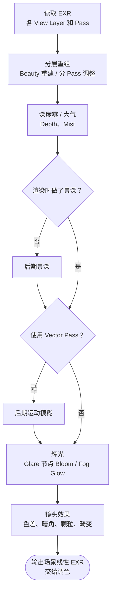

**合成**负责画面技术层面的整合，**调色**负责整体风格统一，二者分开进行。

### 8.2 调色

在 DaVinci Resolve 中进行：

- 以色彩脚本为依据，统一同一场戏里所有镜头的颜色（镜头匹配）。
- 在统一的色彩管理下工作（例如 ACES 或 DaVinci Wide Gamut），输出目标交付色域（见 2.2）。

### 8.3 剪辑与 Conform

- 剪辑时间线从 Animatic 开始**持续存在**，每个环节的新版本都替换进去。
- 使用 **EDL / XML / OTIO** 在剪辑软件和管线之间交换镜头列表和时码。
- **画面锁定（Picture Lock）**之后，按剪辑结果用最终渲染和合成素材重新组装（Conform），交给调色和混音。
- 对应的调整项：Cut、Timing、Transition、Pacing。

### 8.4 声音

| 组成 | 说明 | 时间点 |
|---|---|---|
| Dialogue 对白 | 已在前期录制（见 4.2） | 前期 |
| Music 音乐 | Animatic 阶段用临时音乐，画面锁定后作曲或定稿 | 贯穿 |
| SFX 音效 / Foley 拟音 | 按画面制作 | 画面锁定后 |
| Ambience 环境声 | | 画面锁定后 |
| **Mix 混音** | 对白、音乐、音效分轨（Stems）混合 | 最后 |

工具：DaVinci Resolve Fairlight，或专业 DAW（Reaper、Pro Tools、Nuendo）。

混音规格按平台要求：广播常用 EBU R128（-23 LUFS），流媒体常见 -14 到 -16 LUFS。声道格式（立体声 / 5.1）要事先确定。

---

## 9. 交付与归档

### 9.1 交付物

| 交付物 | 规格示例 |
|---|---|
| 母版（Master） | ProRes 4444 / 422 HQ 或 DNxHR，全分辨率，交付色域 |
| 网络发行 | H.264 / H.265，按平台码率要求 |
| 院线 | DCP（JPEG2000，XYZ 色彩空间；可使用 DCP-o-matic 制作） |
| 音频 | 立体声混音、5.1 混音（如需要）、分轨 Stems（对白 / 音乐 / 效果） |
| 字幕 | SRT / 平台指定格式，多语言 |
| 附带材料 | 海报、剧照、预告片、片头片尾字幕（Credits）、音乐授权文件 |

交付前做 QC：逐帧检查坏帧、黑帧、闪烁、穿插、音画同步和响度。

### 9.2 归档

- 归档内容：发布版资产、镜头最终版工程文件、最终 EXR、合成和调色工程、剪辑工程、混音工程、管线代码、Project Bible、所用 Blender 版本的安装包。
- 中间缓存和旧版本渲染可以按策略清理，但必须保证能用归档内容重新生成最终画面。
- 遵循 **3-2-1 备份原则**：3 份副本、2 种介质、1 份异地。**整个项目期间都要备份，不是等到最后才做。**

---

## 10. 生产管理：审阅、版本与协作

### 10.1 审阅与版本

每个镜头的每个环节都按下面的状态流转：

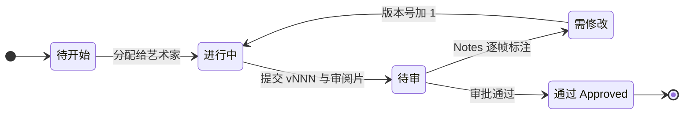

- 版本号**只增不减**，永远不出现 `FINAL` 这类文件名。
- 每次提交都生成审阅片（MP4，烧录镜头名、版本号和帧号）。审阅片由脚本自动生成（如 FFmpeg），统一放在 `07_review/`。
- 上游环节通过之后，下游环节才能拿它的产出开工；上游返工时，要通知已经开工的下游。

### 10.2 生产追踪工具

| 工具 | 说明 |
|---|---|
| **Kitsu**（开源） | 镜头和资产追踪、审阅；有 Blender 插件（Blender Kitsu），Blender Studio 在开放电影项目中使用 |
| ShotGrid（现名 Flow Production Tracking）/ ftrack | 行业标准，商业授权 |
| SyncSketch | 逐帧审阅批注 |
| 表格 + 脚本 | 个人项目的最低配置，至少要有镜头表和资产表 |

### 10.3 版本控制

**按数据类型分开管理**，不要用一种工具管理所有东西：

| 数据 | 工具 |
|---|---|
| 管线代码、配置、元数据、Project Bible | **Git** |
| .blend、贴图等大型二进制文件 | **SVN**（Blender Studio 曾经使用）/ **Perforce** / Unity Version Control（原 Plastic SCM）；Git LFS 只适合小规模 |
| 渲染帧、缓存 | 不进版本控制，按目录版本号管理，并纳入备份 |

说明：Git LFS 可以存储二进制文件，但 .blend 无法合并。项目规模变大后仓库会膨胀，文件锁定体验也一般。所以它不适合作为大量 .blend 的主存储。

---

## 11. 性能与场景规模控制

典型的失控场景：100 个角色 + 1,000 栋建筑 + 10,000 棵树 + 大量 FX 全部直接加载，结果内存、视口和渲染都会崩溃。

| 手段 | Blender 实现 |
|---|---|
| **实例化（Instancing）** | Collection Instance、GN Instance on Points：10,000 棵树实际只存 20–50 份几何体 |
| **LOD** | 环境和群集角色准备 LOD0–LOD3，用 GN 按相机距离切换；主角通常只用一个高质量版本，靠 Subdivision 级别控制 |
| **视口替身** | 视口显示为低模或包围盒（Viewport Display → Bounds），渲染时使用完整资产；也可以用 GN 在视口和渲染中输出不同几何体 |
| **剔除** | Simplify → Camera Culling / Distance Culling；GN 视锥剔除 |
| **Simplify** | 视口限制 Subdivision 级别、贴图尺寸、粒子数量 |
| **缓存** | 见 6.3，动画和模拟只读缓存 |
| **按需加载** | 灯光和渲染文件只 Link 当前镜头可见的区块 |

---

## 12. 推荐工具栈

| 工作 | 纯 Blender 方案 | 常见增强 / 替代 |
|---|---|---|
| 分镜 | Grease Pencil | Krita、Storyboard Pro |
| 建模 / 雕刻 | Blender | ZBrush |
| 拓扑 | Blender（RetopoFlow） | Quad Remesher |
| UV | Blender | RizomUV |
| 贴图 | Blender Texture Paint | Substance 3D Painter、ArmorPaint |
| 资产库 | Asset Browser | Poly Haven、Quixel Megascans |
| 绑定 | **Rigify** | Auto-Rig Pro |
| 动画 | Blender | 动作捕捉（Rokoko、视频动捕） |
| 毛发 / 布料 | Hair Curves / Cloth | — |
| FX | Mantaflow / GN Simulation | Houdini |
| 环境 / 程序化 | Geometry Nodes | Houdini |
| 灯光 / 渲染 | Cycles / Eevee | — |
| 合成 | Blender Compositor | Nuke、Fusion |
| 剪辑 | Blender VSE | DaVinci Resolve |
| 调色 | — | DaVinci Resolve |
| 音频 | — | Resolve Fairlight、Reaper、Pro Tools |
| 生产追踪 / 审阅 | — | Kitsu、ShotGrid / Flow、ftrack |
| 版本控制 | — | Git（代码）+ SVN / Perforce（资产） |
| 渲染农场 | Flamenco | Deadline |
| 自动化 | Python（bpy） | — |

如果希望**尽量纯 Blender**、不依赖 Maya、Houdini、Substance 和 Nuke，完全可以做到。实际上**剪辑之后的调色和音频**通常还是离不开 DaVinci Resolve 或 DAW。代价主要出在大规模 FX 和复杂群集上。

---

## 13. 个人 / 小团队策略与规模评估

### 13.1 先评估规模

商业动画长片通常需要**上百人**制作 **2–5 年**。个人或小团队必须**主动缩小范围**：

| 约束 | 策略 |
|---|---|
| 时长 | 从 3–10 分钟短片开始，做完整部再考虑更长的片子 |
| 角色数 | 主要角色控制在 1–3 个，大量复用绑定 |
| 场景数 | 少量场景、大量机位 |
| 风格 | 风格化比写实便宜得多（贴图、毛发、渲染都更省） |
| 渲染 | 优先 Eevee，或 Cycles 低采样加降噪（见 7.5） |
| 对白 | 少对白或无对白能省下大量口型工作（《Flow》就是无对白长片） |
| 素材 | 背景和道具大量使用现成资产库 |

### 13.2 自动化优先

个人项目不应该按传统电影公司的方式把每个环节都靠人工完成，而应该尽早建立 Python 管线（见第 14 节），把重复操作全部脚本化。

---

## 14. Python 自动化与 AI Agent

### 14.1 Python 管线 API

先实现一套**确定性的**管线函数（Blender 插件 + 命令行工具），这是后面所有自动化的基础：

```python
# 资产
create_asset(type, name)            # 按模板创建 wip 目录和文件
publish_asset(asset, notes)         # 执行检查、复制到 publish/v###、写元数据
load_asset(shot, asset, version)    # Link + Library Override + 规范命名

# 镜头
create_shot(seq, shot, frame_range) # 从镜头表创建目录和各环节 .blend
setup_camera(shot)                  # 按 Project Bible 设置 Sensor、画幅遮罩
setup_render(shot, stage)           # 分辨率 / 帧率 / 色彩管理 / View Layer / Pass / 输出路径
export_cache(shot, stage)           # 导出 Alembic / VDB 到版本化目录

# 渲染与审阅
submit_render(shot, stage, version) # 提交到 Flamenco / Deadline
collect_render(shot)                # 检查缺帧和坏帧
create_preview(shot, version)       # FFmpeg 生成带烧录信息的审阅片
```

自动化后的流程：

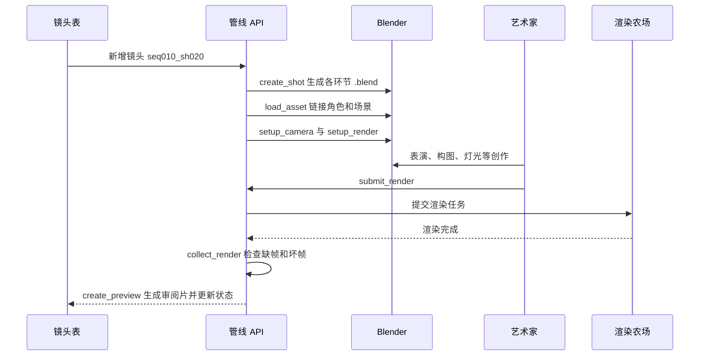

批量任务（渲染、导出缓存、检查）使用**无界面模式**：`blender -b file.blend --python script.py`。

### 14.2 接入 AI Agent（Blender MCP）

Blender MCP 让 LLM Agent 可以操作 Blender。正确的分层是：**Agent 调用管线 API，而不是直接现场生成任意 bpy 代码**。

```mermaid
flowchart TD
  AG["LLM / Agent 框架<br/>Coding Agent 等"] -->|自然语言任务转为工具调用| MCP["Blender MCP<br/>桥接层"]
  MCP -->|调用工具| API["管线 API<br/>14.1 的确定性函数（Blender 插件）"]
  API --> BPY["bpy<br/>Blender 内部"]
  MCP -.->|仅限受控场景：执行任意 Python| BPY
  API -->|"批处理：blender -b"| FARM["渲染农场<br/>无界面模式，不走 MCP"]
```

实线是推荐路径，虚线是需要严格限制的路径（见下方风险表）。

适合交给 Agent 的任务：

- "按镜头表创建 seq010 的全部镜头文件。"
- "把 Hero 放到 seq010_sh020 的街道中央，并加载已发布的最新版本。"
- "用城市生成器生成一条 500 米街道，放置 20 栋建筑。"
- "给这场戏套用 Night_Rain 灯光模板。"
- "检查 seq010 所有镜头的贴图缺失和帧范围，并生成报告。"
- "提交 seq010_sh020 灯光 v003 的渲染，帧范围 1001–1136。"

风险与约束：

| 风险 | 对策 |
|---|---|
| LLM 生成的代码不确定，结果难以复现 | 优先让 Agent 调用管线 API；生成的脚本要存档，并纳入 Git |
| MCP 可以执行任意代码 | 只在本机或受信任的环境中运行；必要时限制可调用的工具，关键操作需人工确认 |
| 误改已发布资产或他人文件 | Agent 只对 `wip/` 和自己负责的镜头有写权限，发布操作必须经过检查流程 |
| 创作决策被自动化稀释 | Agent 负责搭建和执行，表演、构图和灯光的创作决策留给人 |

### 14.3 目标架构

```mermaid
flowchart TD
  LLM["LLM 辅助<br/>拆解剧本、生成镜头表"] -.-> SC["剧本 / 镜头表"]
  SC --> DB[("生产数据库<br/>Kitsu / 自建<br/>资产表、镜头表、状态、版本")]
  DB --> AAPI["资产管线 API"]
  DB --> SAPI["镜头管线 API"]

  AGENT["AI Agent"] --> MCP["Blender MCP<br/>交互式搭建与检查"]
  MCP --> AAPI
  MCP --> SAPI

  AAPI --> WS["Blender<br/>艺术家工作站"]
  SAPI --> WS
  SAPI --> HB["无界面 Blender<br/>缓存导出 / 检查 / 渲染"]

  WS -->|提交渲染| FARM["渲染农场<br/>Flamenco"]
  HB --> FARM
  FARM --> EXR["EXR"] --> REV["审阅<br/>Kitsu"]
  REV -.->|状态回写| DB
  REV --> POST["合成、调色、剪辑、混音"] --> MASTER(["交付母版"])
```

---

## 15. 落地清单：项目模板

下一步最值得做的，不是马上去学某个建模工具，而是先建立一个可复用的 **"Blender 大型动画项目模板"**：

- [ ] **Project Bible**：技术规格、色彩管理、命名规范（第 2 节）
- [ ] **目录模板**：一键生成第 3.1 节的目录结构
- [ ] **模板 .blend**：Layout / Anim / CFX / FX / Light 各一个，预置单位、帧率、色彩管理、Collection 结构
- [ ] **LookDev 场景**：统一 HDRI、灰球、色卡、转台相机
- [ ] **角色绑定基础**：Rigify 元骨骼、面部口型集、ROM 测试动画
- [ ] **资产库**：Asset Library 配置 + 发布脚本 + 发布检查
- [ ] **镜头表 / 资产表**：Kitsu 或表格
- [ ] **管线 API**：`create_shot` / `load_asset` / `setup_render` / `export_cache` / `create_preview`
- [ ] **渲染设置预设**：View Layer、Pass、EXR 输出规格
- [ ] **渲染农场**：Flamenco 部署 + 提交前检查
- [ ] **版本控制与备份**：Git（代码）+ SVN / Perforce（资产）+ 3-2-1 备份
- [ ] **渲染预算表**：按第 7.5 节估算，决定渲染器和硬件
- [ ] **MCP 工具封装**：把管线 API 暴露为 MCP 工具

建议先用一个 **5–10 个镜头的试验短片**把模板完整跑通一遍（从分镜到交付），再投入正式项目。

---

## 附录 A：Blender 特性与版本对应

| 特性 | 起始版本 |
|---|---|
| UDIM | 2.92 |
| Library Override 取代 Proxy | 3.0（Proxy 在 3.x 中移除） |
| Cycles X（去掉 Shadow Pass，新增 Shadow Catcher Pass） | 3.0 |
| 新毛发系统 Hair Curves | 3.3 |
| Geometry Nodes Simulation Zone | 4.0 |
| AgX 成为默认显示变换 | 4.0 |
| Cycles Light Linking | 4.0 |
| Eevee Next | 4.2 |

> 以上是各特性首次引入的版本。5.x 可能调整了部分界面和行为（例如 Pass 名称、节点参数），具体以 5.2 LTS 官方 Release Notes 为准。

## 附录 B：相对原版的修订说明

| 类别 | 修订 |
|---|---|
| 管线顺序 | Layout 移到 Animatic 之后，与资产制作并行；对白录制提前到动画之前；剪辑改为贯穿全程 |
| 缺失环节 | 新增 Bake、LookDev、群集、调色、Conform、交付、归档 |
| 缺失规范 | 新增 Project Bible（分辨率、帧率、单位、帧号约定）、色彩管理、命名规范、WIP / Publish 机制 |
| 技术修正 | Shadow Pass → Shadow Catcher；Vector Pass 与运动模糊互斥；EXR 从一律 32-bit 改为 16/32-bit 分用 + 压缩；Principled BSDF 输入改为并列；Proxy 术语澄清；Rig 层级补上锁骨和 DEF/MCH/CTRL 分层 |
| 补充内容 | Rigify、口型集、Corrective Shape Keys、Alembic / USD / VDB 缓存、View Layer 分层渲染、渲染预算与存储估算、Kitsu 等生产追踪工具 |
| 内部一致性 | 两套目录结构合并为一套；版本控制从"Git 为主"改为按数据类型分工；去掉 `FINAL` 版本命名 |
| AI 架构 | 修正分层为 Agent → MCP → 管线 API → bpy，批量渲染走无界面模式；新增风险与约束 |
| 文档形态 | 去掉对话式开头和结尾；章节层级重排（角色流程收归到 5.1 下）；标注适用的 Blender 版本（5.2 LTS） |
| 图表 | 流程图、架构图、状态流转改用 Mermaid（flowchart / gantt / stateDiagram / sequenceDiagram）；新增示意排期甘特图；命名规范改为表格；目录树保留文本 |
| 流程细化 | 角色资产拆成外观线和绑定线并行；城市生成器改为以路网为起点；Bake 说明中澄清 Curvature / Cavity 没有直接的烘焙类型 |
