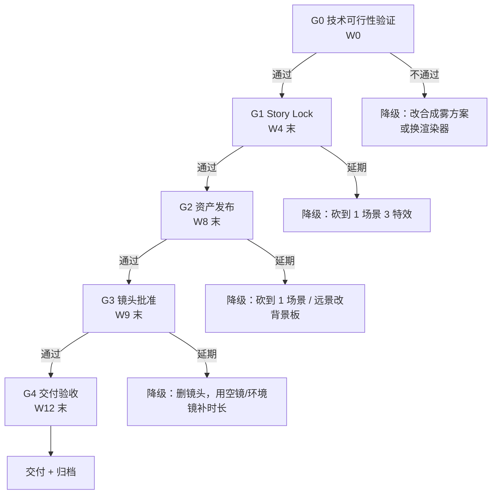
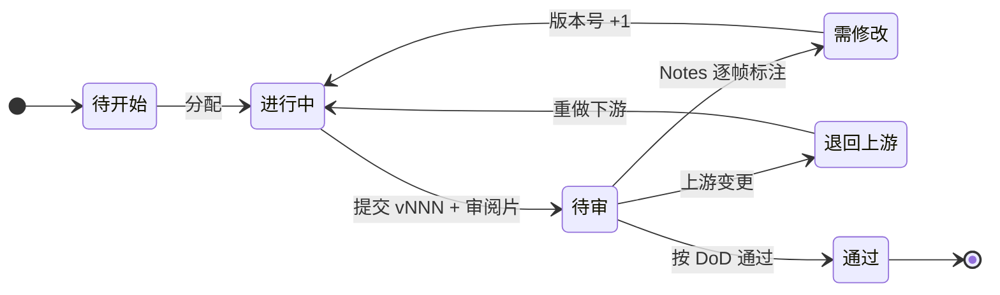
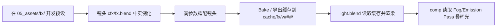

# 仙侠类动画 Demo 开发计划

> **目标**：基于 `docs/dls.md` 管线规范，规划一部**仙侠题材 3D 动画短片（Demo）**的开发计划。Demo 的首要目的是**验证管线与锁定风格**，其次才是"讲一个故事"。
> **适用范围**：个人或 2–3 人小团队，以 Blender 为核心 DCC，优先纯 Blender 方案。
> **锁定版本**：Blender **5.2.0 LTS**（锁定到 patch 版本，非 "5.2"；build hash `fbe6228777e7` 已记入 `00_project/bible/project_bible.md`）。项目中途不升级、不跨 patch 混用。
> **v2.1 修订**：原写 5.2.1 LTS。G0 实测（W0）本机可用版本为 **5.2.0 LTS**，且 §12.1 规定版本不符即退出 —— 若继续锁 5.2.1，全部管线函数无法运行。故锁定改为实测值 5.2.0。依据见 `00_project/bible/g0_feasibility_report.md`。
> **基准场景**：本文件所有预算、排期、里程碑默认按**方案 S（30 秒）**执行。方案 M（90 秒）为升档目标，见附录 B。

### 本次修订说明（v2）

| 原章节 | 变更 | 原因 |
|---|---|---|
| §1 定位与规模 | 拆分**方案 S / 方案 M 两档**，默认执行 S | 原稿 90 秒 / 8 镜对 2–3 人 3 个月不可行 |
| §2 题材拆解 | "Eevee Next" → **EEVEE**；四种光屑做法统一为 GN | 5.2 官方名为 EEVEE；原稿同一件事四种说法 |
| §3 目录结构 | **删除自造目录树**，改为引用 `dls.md` §3.1 + 追加分类 | 原树缺 `veh/` `render/` `publish/v###/`，等于造第三套结构 |
| — | **新增 §4 门禁与降级路径** | 原稿有风险表但没有"卡住了砍什么" |
| §4 分期计划 | 新增 **W0 技术可行性验证**；后期改为**按场次滚动交付** | 原稿渲染与合成分排在同一台机器上，资源冲突未识别 |
| — | **新增 §5 审阅标准与 DoD**、"无对白"与"口型集"矛盾、渲染机时算错 1.67 倍、工期低估 3–4 倍 | 原稿只有状态流转，没有"通过"的判定标准 |
| §5 技术规范 | 色彩管理改为**四元组**；补快门、贴图规格、EEVEE probe 上限 | 原稿表述不严谨，缺可执行数值 |
| — | **新增 §8 声音设计、§9 色彩验证、§10.4 缓存生命周期、§11 性能预算、§13 追踪表 Schema、§16 授权合规、§17 交付 QC、§18.3 事故预案、§21 成功指标** | 原稿缺失的整块环节 |
| §6 FX 管线 | 补**统一技术选型表** + **P0/P1/P2 分级** | 原稿"只做核心 5–7 种"没有分级 |
| §8 渲染预算 | **修正全部算术**；存储按"版本数 × 单版本"重算 | 原稿 `2160×1.5×2.5` 算成 13,500（应为 8,100） |
| §9 工具栈 | 补 5.2 新能力、授权登记工具、追踪表落地 | 原稿未利用 Blender 5.2 实际能力 |
| §10 风险 | 补 EEVEE 体积限制、AgX 去饱和、patch 漂移、零缓冲 | 原稿缺技术类与运维类风险 |
| §11 里程碑 | 新增 **M0** 与**每个里程碑的降级动作** | 原稿里程碑无"不通过怎么办" |
| §12 落地清单 | 同步 `README.md`，标注仓库已有进度 | 两份文档清单原本不一致 |

---

## 1. 项目定位与规模

### 1.1 规模档位与决策规则

原稿的"1–3 分钟"是一个**区间**，而预算、镜头数、场景数都是按单一值给的，二者无法同时成立。改为显式两档：

| | **方案 S（默认执行）** | **方案 M（升档目标）** |
|---|---|---|
| 定位 | 管线验证 + 风格验证 | 可对外发布的完整短片 |
| 片长 | **30 秒** | 90 秒 |
| 镜头数 | 5（平均 6 秒/镜） | 12（平均 7.5 秒/镜） |
| 场景数 | 1（竹林） | 2（竹林 + 云海山巅） |
| 主要角色 | 1（无面部特写） | 1–2 |
| 特效种类 | 3 | 5 |
| 渲染机时 | ≈ 67 机时 | ≈ 165 机时 |
| 周期 | **12 周（2–3 人，含 2 周缓冲）** | **6–9 个月（3 人全职）** |
| 建议 | ✅ **推荐** | 需显式决策 |

**镜长经验值**：动作密集段 2–4 秒/镜，情绪段 4–6 秒/镜，建立段 6–8 秒/镜。**镜数 = 片长 ÷ 平均镜长**，不能先定镜数再凑时长。

**升档到方案 M 的前置条件**（三条全部满足才允许升档，且需在 §20 的 M2 评审上显式记录决策）：

1. G0 技术可行性测试通过（§5.0）；
2. 方案 S 的 5 个镜头**已完整走通**分镜 → 渲染 → 合成 → 调色 → 交付 → QC 全流程；
3. 实际渲染单帧耗时落在估算区间内（±30%）。

升档决策必须在 G2 评审上**书面记录**（结论 + 三条前置条件的证据 + 决策人）。

### 1.2 技术定位（方案 S）

| 项目 | 设定值 | 说明 |
|---|---|---|
| 片长 | **30 秒**（允许 24–40 秒） | Demo 级别，验证管线与风格 |
| 分辨率 | 1920×1080（16:9） | 主交付版；Layout 阶段同时留 9:16 裁切安全框 |
| 帧率 | 24 fps | 锁定，不可更改 |
| 渲染器 | **EEVEE** | 5.2 LTS；**云海/山岚走双轨方案**（渲染器体积 + 合成雾），见 §2.2 |
| 色彩管理 | Scene Linear (Rec.709) / AgX / sRGB / None | 四元组锁定，见 §8.1 |
| 对白 | **无对白** | 省略口型与对白录制；**不做 viseme 口型集**（见 §6.2） |
| 主要角色 | **1 个** | 主角（仙师/侠客）；灵兽/师父**不列入本 Demo** |
| 场景 | **1 个** | 竹林（云海作为远景背景板，不做完整资产） |
| 音频 | 音乐 + 环境音 + 拟音 | **音乐承担全部叙事**，见 §7 |

> **角色数量决策时点**：必须在 W1 美术设定评审上锁定。灵兽 = 第二个角色的骨骼 + 动画 + 毛发，成本约等于 +50% 角色工作量，是范围蔓延的第一入口。

---

## 2. 题材拆解与技术选型

### 2.1 仙侠核心视觉要素

| 要素 | 实现要点 | Blender 方案 |
|---|---|---|
| **古风角色** | 宽袖长袍、发髻束带、佩剑/拂尘 | Rigify 绑定 + Hair Curves 发型 + Cloth 布料模拟 |
| **法术特效** | 飞剑、剑气、光球、符纸、阵纹 | Geometry Nodes + Volume / 材质自发光，见 §9.1 |
| **云雾/大气** | 云海、山岚、仙气缭绕 | **双轨**：近景渲染器体积 + 远景合成雾，见 §2.2 |
| **古风场景** | 山石、竹林、栈道、飞檐 | Geometry Nodes 程序化 + 现成资产库（授权见 §15） |
| **武器/法宝** | 飞剑、古镜、葫芦、符纸 | 道具建模 + 简单绑定 + FX 动画 |
| **风格化光影** | 逆光剪影、月光、灵光、体积雾 | EEVEE + Volumetrics + Light Linking，**限制见 §2.2** |
| **表演风格** | 飘逸的轻功、御剑飞行、打坐、拂尘挥动 | 动作参考（实拍 / AI 单目动捕）+ 手动精修 |

> **术语修正**：`Eevee Next` 是 Blender 4.2–4.5 期间 EEVEE 的开发代号。5.2 LTS 的官方引擎名为 **EEVEE**，且 5.2 对其做了 Screen Space Raytracing 与 Fast GI 的重写（画面亮度较 5.1 略暗）。本文件与后续所有文档统一写 **EEVEE**。

### 2.2 EEVEE 5.2 能力边界（必须在 G0 验证）

EEVEE 5.2 官方手册明确列出的限制，**恰好命中"云海山巅 / 逆光体积雾"这个 Demo 的招牌镜头**：

| EEVEE 限制 | 对本项目的后果 | 应对 |
|---|---|---|
| 体积只对相机光线渲染，不进入反射/折射和 light probe | 水面倒影、古镜反射里**看不到云雾** | 反光面接受"无雾"；或该元素单独走 Cycles 局部渲染 |
| 体积阴影**不投到实体物体上** | 云海在山体/竹林地面**不留下阴影** | 改由合成层（Depth 驱动的遮罩 + Multiply）伪造云影 |
| 仅支持单次散射 | 逆光穿雾层次受限 | 靠多层半透明体积 + 合成雾叠加出层次 |
| 用深度缓冲近似，遮挡物不参与 | 角色遮挡处雾边缘有瑕疵 | 主体人物与雾分 View Layer，主体用 Holdout 排除 |
| Light probe 上限：128 sphere / 视锥内 16 plane；probe capture **不支持镜面反射** | 竹林多光源易撞上限；玉/金属/水面反射质量受限 | probe 数量写进性能预算（§10）；反射靠 Light Linking + 手工反射卡 |
| 仅支持 14 个 GN 属性 | 复杂 GN 材质可能在 EEVEE 下静默失效 | G0 测试中逐条检查关键材质 |

**云雾双轨方案（本 Demo 的默认做法）**：

| 轨 | 用途 | 实现 | 成本 | 可控性 |
|---|---|---|---|---|
| 渲染器体积 | 近景、人物周围的仙气、可见光柱 | EEVEE Volumetrics + Mantaflow/VDB | 中 | 中 |
| 合成雾 | 远景山岚、云海、大气透视 | Depth + Mist + Fog Glow（Compositor / Resolve） | 低 | **高** |

**结论**：云海的**主要表现力应放在合成层**，渲染器体积只做近景。这样既绕过 EEVEE 的体积限制，又让"云海"这个最贵的元素变成最便宜、最可控的元素。

---

## 3. 目录结构与命名规范

### 3.1 目录结构

**完全采用 `dls.md` §3.1 的统一目录，不重画、不改动。** 本项目只在其基础上**追加**仙侠专用资产分类：

| 位置 | 追加内容 |
|---|---|
| `05_assets/chr/hero/` | 主角（沿用 `dls.md` 的 `wip/` + `publish/v###/`） |
| `05_assets/env/` | `bamboo_forest/`（本 Demo 唯一完整场景） |
| `05_assets/prp/` | `flying_sword/`、`feather_fan/`、`talisman/` |
| `05_assets/fx/` | `sword_trail/`、`magic_orb/`、`dust_sparkle/`（**注意：`fx/` 放在 `05_assets/` 下，不在 `lib/` 里**） |
| `05_assets/lib/` | 共享材质、HDRI、**GN 生成器**、灯光模板 `Cloud_Day` / `Night_Moon` / `Hall_Mystic` |

> **原修订说明**：原稿在这里重画了一棵目录树，遗漏了 `veh/`、镜头下的 `render/`、`publish/v###/`、`cache/<阶段>/v<版本>/` 四项，而 `dls.md` 附录 B 已明确"两套目录结构合并为一套"。现改为直接引用，避免产生第三套结构。
> `05_assets/fx/` 是本项目的**新增顶层分类**，需要在 `dls.md` §3.1 同步补一行（`veh` 保留，仙侠项目可为空但保留以维持统一结构）。

### 3.2 命名规范

| 类别 | 规则 | 示例 |
|---|---|---|
| 资产 | `<类型>_<名称>_<变体>` | `chr_hero_meditation`、`prp_flying_sword_glow` |
| 镜头 | `seq<三位>_sh<三位>` | `seq010_sh010` |
| 文件 | `<镜头或资产>_<环节>_v<三位>.blend` | `seq010_sh010_anim_v012.blend` |
| 渲染帧 | `<镜头>_<环节>_v<三位>.<四位帧号>.exr` | `seq010_sh010_light_v003.1001.exr` |
| **缓存** | `cache/<阶段>/v<三位>/` | `cache/cfx/v002/cloth_hero.abc` |
| **渲染目录** | `render/<阶段>/v<三位>/` | `render/light/v003/` |
| 审阅片 | `<镜头>_<阶段>_v<三位>_burn.mp4` | `seq010_sh010_light_v003_burn.mp4` |
| 音频 | `<类别>_<名称>_v<三位>.<ext>` | `sfx_sword_swing_01_v002.wav` |
| 交付 | `<片名>_<版本>_<规格>.<ext>` | `XianxiaDemo_v001_master_ProRes422.mov` |

**Sequence 编号规则**（原稿编号混乱：出现过 `sh005` / `sh010` / `sh020` / `sh005` 四种）：

- `SEQ<三位>`：每 10 个镜头递增一档（SEQ010 = 镜头 010–090，SEQ020 = 100–190，以此类推）。
- `sh<三位>`：镜头在 Sequence 内递增，**从 010 开始，不使用 001/005**。
- 一次锁定，全程不重编号；废弃镜头保留编号并标 `status: dropped`。

---

## 4. 门禁、里程碑与降级路径

### 4.1 门禁定义

每个门禁有**明确的判定项**和**明确的降级动作**。不通过不是"再努力一下"，而是**执行降级**。



### 4.2 降级阶梯（按顺序执行，不跳级）

| 顺序 | 触发条件 | 降级动作 | 影响 |
|---|---|---|---|
| L1 | 渲染机时累计 > 100 机时（方案 S） | 删镜头：保 3 个核心镜头 + 2 个环境空镜补时长 | 时长 30s → 24s |
| L2 | EEVEE 体积不达标 | 全部雾改走合成层，渲染器只留主光 | 画质略降，工期不变 |
| L3 | 单帧耗时 > 5 分钟 | 分辨率降到 1600×900 | 画质降，后期可上变换 |
| L4 | 主角绑定延期 > 1 周 | 取消 Hair Curves 与 Cloth，改为静态发髻 + 造型网格 | 表演质感降，可接受 |
| L5 | 美术设定延期 | 主角改用现成 base mesh 改造（Blender Online Essentials） | 风格统一性降 |
| L6 | 任何门禁延期 > 2 周 | 触发**范围重议**，重排 §4 排期，必要时把周期从 12 周延到 16 周 | 不可接受延期 |

> 降级的判断必须在门禁评审上**书面记录**（结论 + 依据 + 决策人），不能靠口头。

---

## 5. 分期计划

### 5.0 第 0 周：G0 技术可行性验证（前置，不可跳过）

**半天到一天，一个空的 Blender 文件就能做完。** 这一步验证 EEVEE 的已知限制（§2.2）在本项目风格下是否可接受。

| # | 测试项 | 通过标准 | 不通过的动作 |
|---|---|---|---|
| T1 | 云海 + 逆光 + 体积雾 | 出 1 张关键帧，雾的层次与光柱可接受 | 全部改走合成雾（§2.2 双轨） |
| T2 | 体积在水面/古镜反射中的表现 | 缺失可接受，或该元素单独走 Cycles | 放弃反射中的雾 |
| T3 | 竹林逆光剪影（10k 实例 GN 散布） | 单帧 < 90 秒，剪影干净无噪点 | 降低实例数 / 换 LOD 策略 |
| T4 | 自发光法术光球在 AgX 下的表现 | 颜色不发白；否则确定 per-shot 色彩策略（§8.2） | 关键 FX 镜头改用 Khronos PBR Neutral |
| T5 | **色彩全链路验证** | 测试图经 渲染 → 合成 → Resolve → 导出 后与源图一致（§8.3） | 停止，先修色彩链路 |
| T6 | Headless 渲染 + EXR multilayer 输出 | 帧数正确、Pass 齐全、可正常读回 | 修渲染设置预设 |

**产出**：`00_project/bible/g0_feasibility_report.md`（含 6 张测试关键帧 + 结论表）。

### 5.1 第一阶段：前期制作（W1–W4）

| 周次 | 任务 | 产出 | 负责人 |
|---|---|---|---|
| W1 | 剧本定稿 | 剧本（一页，30 秒） | 导演 / 编剧 |
| W1 | 美术设定 | 主角三视图 + 服装配色 + 竹林气氛图 + FX 风格参考 | 原画 / 设定 |
| W1 | **角色数量与场景数量锁定** | 决策记录（1 角色 / 1 场景） | 导演 |
| W1 | 色彩脚本 | 逐镜色彩脚本（5 镜） | 导演 / 灯光 |
| W2 | 分镜脚本 | Storyboard（5 镜）+ 时码 | 导演 |
| W2–W3 | Animatic + 剪辑 | Blender VSE 剪辑 + **临时音乐** + 镜头时码 | 剪辑 / 导演 |
| W2–W3 | **声音设计介入** | 音乐结构 + 关键音效点标记（§7.2） | 声音 |
| W3 | 素材与授权登记 | 授权清单初稿（§15） | 制片 |
| W3–W4 | 故事锁定 + 镜头表 | Shot List（镜号、帧范围、角色、场景、FX、灯光模板、人日） | 制片 / 导演 |

**关键里程碑 G1 — Story Lock（W4 末）**：分镜定稿、时长锁定、镜头表锁定、色彩脚本通过、声音结构确认。
**不通过 → 降级 L1（砍到 1 场景 3 特效）**，见 §4.2。

> **声音必须早期介入**：无对白片由音乐承担全部叙事。如果 W2–W3 的 Animatic 没有临时音乐 + 音效点标记，到 W11 混音时才会发现节奏全错，届时改画面代价极高。

### 5.2 第二阶段：资产制作（W2–W8，与前期后半程并行）

与前期后半程并行。**每个资产走 `dls.md` §5.1 流程。**

#### 5.2.1 角色资产（W2–W7）

| 周次 | 任务 | 产出 |
|---|---|---|
| W2–W4 | 主角建模 + 雕刻 + 拓扑 | 动画模型（3–6 万四边面，不含衣袍/发丝） |
| W4–W5 | UV + Bake + Texture | 基础材质贴图 |
| W5 | LookDev + 转台审阅 | **发布 `chr_hero_model_v001`、`chr_hero_shading_v001`** |
| W5–W6 | Rigify 身体绑定 + **表情 shape keys** | ROM 测试通过，发布 `chr_hero_rig_v001` |
| W6–W7 | Hair Curves + Cloth 资产设置 | 披风/发带初始模拟参数 |

> **面数口径修正**：原稿"约 3–5 万面"未说明是四边面还是三角面。EEVEE 的实际成本看三角面，因此写清：3–6 万**四边面**（不含衣袍/发丝），衣袍另计 5–10 万。
> **发布粒度**：资产拆成 `model` / `shading` / `rig` 三个独立发布单元（`dls.md` §3.2）。原稿"W5 LookDev 通过后发布 v001"没说发的是哪个子资产。
> **不做口型集**：无对白（§1.2），只需表情 shape keys（微笑 / 闭眼 / 蹙眉 / 惊讶）+ 基础 FACS 控制器。原稿的"面部口型集"与"无对白"直接冲突，属于白做的工作。

#### 5.2.2 环境资产（W5–W7）

| 周次 | 任务 | 产出 |
|---|---|---|
| W5–W6 | 竹林建模 | 模块化资产（3–4 个区块） |
| W6 | 程序化生成器（GN） | 竹子散布、山石阵列生成器 |
| W7 | 环境发布 | `env_bamboo_forest_v001` |

> **古殿降级**：古殿（建筑类）在本 Demo 中**不做**。云海作为远景背景板处理。原稿排了 3 个场景 W5–W8 全做，对 2–3 人是不可行的范围蔓延。

#### 5.2.3 道具与特效资产（W4–W7）

| 周次 | 任务 | 产出 |
|---|---|---|
| W4–W5 | 飞剑、拂尘建模 + 绑定 | 可动画道具 |
| W5–W7 | FX 预设开发（**只做 P0 三种**，见 §9.2） | 剑气轨迹、法术光球、光屑 |
| W7 | FX 资产发布 | `05_assets/fx/` 下全部预设 |

**关键里程碑 G2 — 资产发布（W8 末）**：主角三单元 + 竹林 + 道具 + 3 个 FX 预设全部发布并通过 LookDev / ROM 审阅。
**不通过 → 降级 L4（取消 Hair/Cloth）或 L5（改用现成 base mesh）**。

### 5.3 第三阶段：镜头制作（W6–W9）

每个镜头按 `dls.md` §6 核心循环推进。

| 周次 | 任务 | 说明 |
|---|---|---|
| W6–W7 | Layout（全部镜头） | 代理粗模确定构图、机位、时长、**9:16 裁切安全框** |
| W7–W8 | 动画（分阶段） | Blocking → Blocking Plus → Spline → Polish |
| W8–W9 | CFX + FX | 布料、发丝、法术特效 |
| W9 | 灯光 | 套用灯光模板 + 局部 Light Linking |
| W9 | 逐镜渲染 + 合成 | 少量镜头，可与后期串行 |

**镜头状态流转**（完整状态机见 `dls.md` §10.1）：



> 原稿只画了 `todo → wip → review → retake → review → approved` 一条线性路径，缺"退回上游"。资产重发后下游必须重做，这个分支是实际生产中最常用的一条。

**关键里程碑 G3（W9 末）**：5 个镜头全部 `approved`。
**不通过 → 降级 L1（删镜头）。**

### 5.4 第四阶段：后期与交付（滚动，W9–W12）

**原稿把渲染（W9–W10）和合成/调色（W10–W12）排在同一台机器上，但渲染要占 4–10 天连续时间，期间该机不可他用。改为按场次滚动交付：**

| 周次 | 任务 | 产出 |
|---|---|---|
| W9 | 渲染场次 A（镜头 1–3） | EXR → 合成 → 调色 |
| W10 | 渲染场次 B（镜头 4–5） | EXR → 合成 → 调色 |
| W10 | **声音制作**（音效 / 拟音 / 环境声） | 分轨 WAV（§7） |
| W11 | **Conform**（按最终镜头列表重组） | 剪辑时间线定稿 |
| W11 | 音乐定稿 + 混音 | 最终混音 + stems（§7.3） |
| W11–W12 | **色彩验证 + 交付 QC** | QC 报告（§16.2） |
| W12 | 交付 | 母版 + 网络版 + 竖屏版（§16.1） |
| W12 | 归档 | 按 §17 清单归档 + **恢复演练** |

> 原稿 4.4 把"音效 + 混音"压到 1–2 周且没有音乐制作步骤。无对白片的音乐是叙事主体，1–2 周做完音效+混音是不现实的（除非音乐为外购/授权素材）。
> W11–W12 的"缓冲"是刻意留的，不是排不满。

---

## 6. 审阅标准与 DoD

原稿只有状态流转，**没有"通过"的判定标准**。没有 DoD，"通过"就变成主观争论，进度也无法统计。

### 6.1 审阅 SOP

- 每次提交必须附**带烧录信息的审阅片**（镜号 + 阶段 + 版本 + 帧号 + 时码），由脚本生成（`create_preview`），放 `07_review/`。
- Notes 必须**逐帧标注**，只写"帧号 + 现象 + 期望"。
- 审阅在 **24 小时内**给出结论（`approved` / `retake` / `rollback`），超时不响应视为默认 `approved`——这条能有效防止小团队互相等。
- 每次评审只做**决定**，不现场改文件。

### 6.2 各阶段 DoD

| 阶段 | 通过标准（全部满足才算 `approved`） |
|---|---|
| **Layout** | 构图与色彩脚本一致；时长与镜头表一致；9:16 裁切安全框内主体完整；机位/焦段已记录；无穿帮道具 |
| **Anim** | 姿态可读（剪影测试通过）；切线/切点符合剪辑；Blocking 曲线干净；**无角色/场景穿插**；ROM 无跳变 |
| **CFX** | 布料/发丝无自穿、无穿模；模拟连续无跳帧；**seed 已固定，重跑结果一致**；缓存已导出且版本对应 |
| **FX** | 形态可读（单帧截图能认出是什么）；与角色/环境接触关系正确；发光不溢出（AgX 下不发白）；缓存已导出 |
| **Light** | 与色彩脚本匹配（色温/主光方向/对比）；Light Linking 生效；probe 数量在预算内；无漏光/噪点 |
| **Render** | 无缺帧坏帧（`collect_render` 通过）；Pass 齐全；EXR 位深/压缩符合 §7.3 |
| **Comp** | 分层重组正确；Depth/Mist 雾层次正确；辉光/镜头效果克制；输出为场景线性 EXR |
| **Grade** | 同场次镜头匹配；legal range 内；示波器无异常；全片色调统一 |
| **Mix** | 响度达标（§7.3）；无削波；音乐/音效分轨已交付 |

---

## 7. 技术规范速查表

### 7.1 项目规格

| 项目 | 设定值 |
|---|---|
| Blender 版本 | **5.2.0 LTS**（锁 patch，build hash `fbe6228777e7` 记入 Bible） |
| 分辨率 | 1920×1080（16:9）；降级档 1600×900 |
| 帧率 | 24 fps |
| 画幅遮罩 | Layout 阶段启用 16:9 + 9:16 双安全框 |
| 快门角度 | **180°**（0.5 帧运动模糊） |
| 场景单位 | 公制，1 unit = 1 m |
| 帧号约定 | 每镜从 1001 起，前后各留 8 帧 handles（有效帧 1009–1128，渲染 1001–1136） |
| 渲染器 | **EEVEE**（默认）/ Cycles（仅 T2 反射雾等局部高精） |
| 缓存格式 | Alembic (.abc) / OpenVDB (.vdb) |
| 贴图上限 | 单张 ≤ 4K；UDIM 用于主角；非必要不建 8K |
| 贴图色彩空间 | Base Color / Emission 用 sRGB；Roughness / Metallic / Normal / Displacement 用 Non-Color |

### 7.2 色彩管理（四元组，锁定）

| 项 | 值 |
|---|---|
| 工作色彩空间 | Scene Linear（Blender 内建已是 Rec.709 primaries） |
| 显示变换 | **AgX** |
| 显示设备 | sRGB |
| Look | **None**（如需风格化另开 per-shot 记录，不全局改） |
| 渲染输出 | EXR 保存场景线性，**不烘入显示变换** |
| 交付色域 | Rec.709 |

> 原稿写"Linear Rec.709 + AgX"，"Linear Rec.709"不是 Blender 的可选项（Scene Linear 已经就是），表述不严谨。改为四元组后才是可执行的。

### 7.3 输出规格

| 项 | 值 |
|---|---|
| 格式 | **OpenEXR Multilayer** |
| 位深 | 颜色类 Pass **16-bit Half**；Depth / Position / Vector / Cryptomatte 等数据 Pass **32-bit**（可单独输出一个 32-bit 文件） |
| 压缩 | DWAA（颜色 Pass）/ ZIP（数据 Pass） |
| 色彩 | 场景线性，不烘入显示变换 |
| 命名 | `render/light/v003/seq010_sh010_light_v003.1001.exr` |
| 禁用 | **不得**直接输出 MP4 / PNG 作为最终素材；MP4 仅用于审阅 |

### 7.4 EEVEE 渲染设置约束

| 项 | 约束 |
|---|---|
| Light probe sphere | **≤ 128**（EEVEE 硬上限） |
| Light probe plane（视锥内） | **≤ 16**（EEVEE 硬上限） |
| Shadow pool | 竹林多光源场景需启用 Large Shadow Pool 选项 |
| Volumetrics | 单次散射；仅相机光线；不进反射与 probe |
| 运动模糊 / Vector Pass | **二者互斥**，选其一（要后期运动模糊就关渲染运动模糊） |

---

## 8. 声音设计

原稿 §1 定了"无对白"，但**没有一节讲声音**。无对白片由音乐承担全部叙事，声音不是收尾工序，是从 Animatic 就介入的要素。

### 8.1 组成与时间点

| 组成 | 内容 | 时间点 |
|---|---|---|
| **Music 音乐** | 30 秒古风/氛围音乐，**承担全部叙事** | Animatic 用临时音乐 → W10 定稿（作曲或授权） |
| **Ambience 环境音** | 竹林风声、竹叶沙沙、远处水声 | W10 |
| **Foley 拟音** | 衣料摩擦、脚步、拂尘挥动 | W10 |
| **SFX 音效** | 剑鸣、法术启动/释放、灵光嗡鸣、符纸燃烧 | W10 |
| **Mix 混音** | 分轨混合 | W11 |

### 8.2 Animatic 阶段的介入项（W2–W3）

即使只是临时素材，也要在 VSE 时间线上标出：

- 音乐的**结构点**（起 / 转 / 收）；
- 3–5 个**关键音效点**（对应剧情节点）；
- 每个镜头的**入点/出点**与音乐的呼吸对齐。

Blender 5.2 新增了 **Sound sockets** 和 VSE 的 **"Sync to Audio" 播放设置**，Animatic 阶段可以直接随音乐实时预览，剪辑效率提升明显。

### 8.3 交付规格

| 项 | 值 |
|---|---|
| 采样率 / 位深 | 48 kHz / 24 bit |
| 声道 | 立体声（本 Demo 不做 5.1） |
| 响度 | **-14 LUFS**（网络平台）；真峰值 **≤ -1.0 dBTP** |
| 交付分轨 | 音乐 / 音效 / 环境 三个 stems WAV + 最终混音 |
| 归档 | 音频源文件 + 工程 + 授权文件（§15） |

---

## 9. 色彩管理与验证

### 9.1 全链路验证（G0 的 T5 项，W0 必做）

色彩链路（Blender AgX → EXR → 合成 → Resolve → 导出）极易静默偏色，且**偏色在最后交付时才发现，返工要重渲全片**。因此必须在 W0 验证一次。

**测试图内容**：8 级灰阶梯 + ColorChecker 24 色卡 + Rec.709 色域边界块 + 纯白/纯黑块 + 一个 90% 亮度的柔和高光块（测 AgX 高光滚降）。

### 9.2 验收标准

- 灰阶梯各阶在导出后**无跳变**（ΔE < 1.5，用 ΔE Calculator 抽查 4 点）；
- ColorChecker 24 色的 **ΔE 平均 < 2.0、最大 < 4.0**；
- 色域边界块无溢出（legal range 内）；
- 同一测试图在 **Blender 视口 / Blender 合成输出 / Resolve / 导出的 MP4** 四处对比，色差肉眼不可辨。

### 9.3 AgX 对本项目的已知副作用

**AgX 会对高亮高饱和色做去饱和**，而法术光球、剑气、灵光正是本项目的招牌元素——在 AgX 下容易发白发灰。

**应对（per-shot 策略，不全局改）**：

| 情况 | 处理 |
|---|---|
| FX 关键镜头自发光过曝发白 | 该镜头 View Transform 改 **Khronos PBR Neutral**，或 Standard |
| 整体自发光偏灰 | 保留 AgX，后期（Comp / Grade）局部提饱和 |
| 拿不准 | 两种各渲一帧关键帧对比，选定后记录到色彩脚本 |

---

## 10. 仙侠专属 FX 管线

### 10.1 统一技术选型表

原稿对同一件事给了四种说法（粒子系统 / GN Simulation Zone / VDB / Mantaflow）。统一为下表，**新增项目一律按此表选型**：

| 需求 | 选定方案 | 不选的原因 |
|---|---|---|
| 光屑、灵光点、飞散尘埃 | **Geometry Nodes（Simulation Zone）+ Point Instance** | 粒子系统（Particle System）在 5.2 仍存在但属旧流程，新项目不用 |
| 剑气 / 阵纹 / 符纸发光 | **曲线 + 自发光材质 + 合成辉光** | 不需要模拟 |
| 局部有源烟雾（符纸燃烧、法术起手） | **Mantaflow Gas** | 有源、有运动才值得用 |
| 大面积静态云海 / 远景山岚 | **合成雾（Depth + Mist + Fog Glow）** | 成本最低、可控性最高，且绕过 EEVEE 体积限制（§2.2） |
| 布料 / 发带 | **Cloth**（必要时评估 5.2 的 GN XPBD） | 5.2 新增节点物理 XPBD，实验特性，**可评估但不作为唯一路径** |
| 飞剑飞行轨迹 | **Alembic 缓存 + 曲线驱动的尾迹** | 复用为主 |

### 10.2 特效清单与优先级

原稿列了 7 种又说"只做核心 5–7 种"，等于没分级。方案 S **只做 P0 三种**：

| 特效 | 优先级 | 复杂度 | 技术方案 | 复用性 |
|---|---|---|---|---|
| 剑气轨迹 | **P0** | 中 | GN Curve + 自发光 + 辉光 | 高 |
| 法术光球 | **P0** | 低 | 球体 + Emission + 合成辉光 | 高 |
| 光屑 / 尘雾 | **P0** | 低 | GN Simulation Zone + Point Instance | 高 |
| 云雾体积 | P1 | 高 | 合成雾为主 + 近景渲染器体积 | 中，按场景预烘焙 |
| 飞剑飞行 | P1 | 中 | Alembic 缓存 + 尾迹粒子 | 中，单镜头为主 |
| 阵纹发光 | P1 | 低 | 平面 + Texture + 辉光 | 高 |
| 符纸燃烧 | P2 | 中 | Cloth + Mantaflow Fire | 低 |
| 古镜 / 法宝特效 | P2 | 中 | 道具 + 简单绑定 | 低 |

**P0 三种在 W7 前完成并发布；P1 视 G2 通过情况；P2 默认不做。**

### 10.3 特效工作流



- 所有 FX 预设封装为 **Asset Library**，镜头里只调参数。
- 体积雾、火、烟等重计算特效**必须缓存**，不在渲染时重算。

### 10.4 缓存生命周期（原稿完全缺失）

2–3 人团队最常在这里翻车。必须先定死规则：

| 规则 | 内容 |
|---|---|
| **缓存路径** | `cache/<阶段>/v<三位>/`，与源文件版本号对应 |
| **失效矩阵** | 改角色拓扑 → `cfx` / `fx` / `light` 缓存**全部失效**；改材质 → 仅 `light` 失效；改灯光 → 无缓存失效；改 FX 参数 → 仅 `fx` 失效 |
| **模拟复现** | Cloth / 烟 / 粒子**必须固定 seed**（对象级 Random Seed 锁定并记录在元数据），否则重跑结果不同，无法复现与对比 |
| **失效检查** | 每次发布资产后运行 `check_cache(shot, stage)`，列出所有失效镜头并通知下游 |
| **版本对应** | `light.blend` 只能读同版本或明确指定版本的缓存，禁止读 `latest` |
| **清理阈值** | 缓存总量 > 100 GB 时清理"非当前版本 + 非当前镜头"的缓存；**清理前必须确认归档件可重新生成**（§17） |
| **导出记录** | 每次 `export_cache` 写元数据：源文件版本、帧范围、seed、导出时间、体积 |

---

## 11. 性能与场景规模预算

原稿只给了"角色 ≤ 2 个、特效 ≤ 5 个实例"。EEVEE 的真实成本在别处。**这些上限必须在 G0 之后、Layout 之前定死并写进 Bible。**

| 指标 | 上限 | 超限处理 |
|---|---|---|
| 单镜头角色数 | 2（本 Demo 1） | — |
| 同屏 FX 预设实例 | 5（本 Demo 3） | 拆分镜头或合批 |
| **单镜头总三角面** | **150 万** | GN 实例化 / LOD / 视锥剔除 |
| 材质数 / 材质槽 | 60 | 合并同类材质 |
| 灯光数 | 20 | Light Linking 复用 |
| Light probe sphere | 128（EEVEE 硬上限） | 提高 probe 覆盖效率 |
| Light probe plane（视锥内） | 16（EEVEE 硬上限） | 改用 sphere |
| VDB 体素分辨率 | 128³ | 降分辨率 + 后期补偿 |
| GN 实例数（竹林） | 10,000 | 提高几何复用率 |
| 显存 VRAM | ≤ 20 GB | 拆镜头 / 降体积分辨率 |
| 单镜头 Alembic 缓存 | ≤ 2 GB | 降拓扑 / 只导可见区块 |
| View Layer 数 | ≤ 4 | 重渲成本线性增长 |

**性能手段**（沿用 `dls.md` §11）：Collection Instance、GN Instance on Points、LOD0–LOD3、Simplify（视口限制 Subdivision / 贴图尺寸）、Camera Culling、灯光与渲染文件只 Link 当前镜头可见区块。

---

## 12. 自动化与 AI Agent

### 12.1 管线 API 现状

**仓库已有实现**（`00_project/pipeline/`，共 5 个模块 201 行）：

| 模块 | 已有函数 |
|---|---|
| `utils.py` | `normalize_name`、`next_version`、`ensure_relative_path`、`check_scale`、`metadata_template` |
| `asset.py` | `create_asset`、`publish_asset`、`load_asset` |
| `shot.py` | `create_shot`、`setup_camera`、`setup_render` |
| `cache.py` | `export_cache`、`check_cache` |
| `review.py` | `create_preview` |

**仍需补齐**（原稿 §7 未提及现状，也未列这些缺口）：

| 缺口 | 函数 | 说明 |
|---|---|---|
| 打开自检 | `audit_shot(shot, stage)` | 贴图缺失、帧范围、输出路径、探针超限、绝对路径、seed 是否固定 |
| 资产升级 | `upgrade_asset(shot, asset, to_version)` | 显式升级 + Resync，**必须人工确认** |
| 依赖图 | `get_dependencies(shot)` | 列出该镜头引用的全部资产及版本，供失效检查 |
| 追踪表 | `read_shotlist()` / `write_status(shot, status)` | 读写 §13 的追踪表 |
| 渲染收集 | `collect_render(shot)` | 检查缺帧/坏帧 + **失败重渲** |
| 版本号分配 | 由 `next_version` 承担 | 已实现，**禁止手工填版本号** |

**统一签名约定**（原稿未定义，是 Agent 可用性的前提）：

- 所有函数返回 `dict`，成功含 `{"ok": True, ...}`，失败含 `{"ok": False, "error": str, "hint": str}`；
- **只读函数绝不写盘**；写盘函数必须 `--dry-run` 可用；
- 所有函数接受 `--project-root`，不使用硬编码路径；
- 启动即校验 Blender 版本 == `5.2.0`，不匹配直接退出（`pipeline/utils.py` 的 `check_blender_version()` 已实现）。

### 12.2 适合本项目的 AI Agent 任务

| 任务 | 说明 |
|---|---|
| "按镜头表创建 seq010 全部 5 个镜头文件" | 批量脚手架 |
| "在 seq010_sh010 的竹林里放置主角，加载 chr_hero_rig 的最新已发布版本" | 资产装配 |
| "用竹子生成器生成 8000 株竹子，bake 到 cache/fx/v001" | 程序化内容 |
| "给 seq010 全部镜头套用 Cloud_Day 灯光模板" | 标准化灯光 |
| "检查 seq010 全部镜头的贴图缺失、帧范围、探针数量，生成报告" | QA |
| "提交 seq010_sh010 灯光 v003 渲染，帧范围 1001–1136" | 渲染调度 |
| "列出所有缓存已失效的镜头" | 缓存管理（§10.4） |

### 12.3 风险控制（具体化）

原稿只写了"Agent 只对 wip/ 有写权限"，但**只靠约定不够**。落地手段：

| 风险 | 对策（可执行） |
|---|---|
| 误改已发布资产 | `publish/` 目录**操作系统只读**（chmod）+ 提交前 `publish_asset` 校验 + `publish/` 在 Git 中忽略 |
| 误改他人镜头 | Agent 工作副本在临时目录，产出经人工确认后才合并回 `wip/` |
| 代码不确定、结果不可复现 | Agent **只允许调用 §12.1 的确定性函数**；生成的临时脚本必须落盘并纳入 Git |
| MCP 可执行任意代码 | 只在本机/受信任环境运行；禁用 `bpy.ops.wm.*` 类危险操作；发布与重渲需人工确认 |
| 创作决策被稀释 | 表演、构图、灯光的**创作决策**留给人；Agent 只做搭建、检查、批处理 |
| 误删缓存/渲染输出 | 所有 `rm` 类操作先 dry-run 列出清单，人工确认 |

---

## 13. 追踪表 Schema

原稿 §9 提"表格 + 脚本"，§12 提"镜头表"，但**没有定义字段**。`create_shot` 依赖镜头表，表不存在则自动化无从谈起。

**位置**：`00_project/pipeline/shotlist.csv`（Git 管理，代码生成/更新）

**镜头表字段**：

| 字段 | 示例 | 说明 |
|---|---|---|
| `shot_id` | `seq010_sh010` | 主键 |
| `seq_id` | `SEQ010` | 场次 |
| `description` | 竹林中主角拂尘起手 | 一句话 |
| `frame_start` / `frame_end` | 1001 / 1136 | 渲染范围 |
| `shot_start` / `shot_end` | 1009 / 1128 | 有效范围（去 handles） |
| `duration_s` | 5.0 | 由帧范围推导 |
| `camera_move` | `dolly_in` | 机位运动 |
| `focal_length` | 35 | 焦段 |
| `characters` | `chr_hero` | 逗号分隔 |
| `environments` | `env_bamboo_forest` | 逗号分隔 |
| `props` | `prp_feather_fan` | 逗号分隔 |
| `fx` | `fx_sword_trail,fx_dust_sparkle` | 逗号分隔 |
| `light_template` | `Cloud_Day` | 灯光模板 |
| `status` | `todo` | 状态机取值 |
| `anim_version` / `cfx_version` / `fx_version` / `light_version` | `v003` | 各阶段当前版本 |
| `owner` | `fred` | 负责人 |
| `est_days` | 2.5 | 预估人日 |
| `actual_days` | 3.0 | 实际人日（用于校准后续估算） |
| `notes` | | 备注 |

**资产表字段**：`asset_id`、`type`、`name`、`variant`、`status`、`version`、`owner`、`wip_path`、`publish_path`、`dependencies`、`rom_passed`、`lookdev_passed`、`updated_at`、`notes`

> 有了 `est_days` / `actual_days`，第 3 次排期就能用真实数据校准，而不是每次重新拍脑袋。

---

## 14. 渲染预算与硬件

### 14.1 时长与帧数（方案 S）

| 参数 | 值 | 推导 |
|---|---|---|
| 片长 | 30 秒 | §1.1 |
| 帧率 | 24 fps | 锁定 |
| 有效帧数 | 720 | 30 × 24 |
| handles 开销 | +80 | 5 镜 × 16 帧 |
| **实际渲染帧数** | **800** | 720 + 80 |
| 镜头数 | 5 | 平均 6 秒/镜 |

### 14.2 单帧耗时（加权）

| 镜头类型 | 数量 | 单帧耗时 | 机时占比 |
|---|---|---|---|
| 环境空镜 / 远景 | 2 | 40 秒 | 11% |
| 单角色 + 环境 | 2 | 3 分钟 | 49% |
| 角色 + FX + 体积 | 1 | 5 分钟 | 41% |
| **合计 / 加权平均** | **5** | `(2×0.67 + 2×3 + 1×5) ÷ 5` | **≈ 2.5 分钟/帧** |

### 14.3 总机时（已修正算术）

```text
渲染机时 = 实际渲染帧数 × 加权单帧耗时
         = 800 × 2.5 分钟
         = 2,000 分钟

重渲系数 = 1.8（View Layer 分层已降低重渲成本）+ 0.2（坏帧/重试/测试）= 2.0

总机时 = 2,000 × 2.0 = 4,000 分钟 ≈ 67 机时
```

> **原稿修正**：原稿写 `2160 帧 × 1.5 分钟 × 重渲系数 2.5 ≈ 13,500 分钟 ≈ 225 机时`。
> 按其自身给定的参数，正确结果是 `2160 × 1.5 × 2.5 = 8,100 分钟 = 135 机时`，原稿高估 1.67 倍。
> 本版把**重渲系数拆解为两项**（分层重渲 1.8 + 坏帧重试 0.2）而不是拍一个 2.5，这样假设是可检查、可调整的。

### 14.4 工期（三档，明确假设利用率）

| 方案 | 假设有效利用率 | 工期 |
|---|---|---|
| 单台工作站（8 核 / RTX 4090 / 24G） | 65% | **4.3 天** |
| 2 台工作站 | 70% | 2.0 天 |
| Flamenco 农场，4 节点 | 85% | 0.8 天 |
| Flamenco 农场，8 节点 | 90% | 0.4 天 |

> **原稿修正**：原稿"单台 3–4 天 / 2 台 2 天 / 4–8 节点 1 天"三个数字互不自洽（225 机时 ÷ 24h ÷ 65% ≈ 14 天，不是 3–4 天；4 节点也不可能 1 天）。本版把利用率作为显式假设列出。
> **利用率为什么不是 100%**：渲染期间同一台机器还要跑合成/调色/审片，不可能独占。

### 14.5 存储（按版本数重算）

| 项 | 单版本 | 说明 |
|---|---|---|
| 渲染输出 | 800 × 50 MB = **40 GB** | 1080p 多层 EXR，4 View Layer + Passes，保守取 50 MB |
| 保留版本数 | × 2 | 最终版 + 1 次返修版 |
| 渲染输出小计 | **80 GB** | |
| 缓存（Alembic + VDB） | 25 GB | 布料 6 + FX 12 + 云雾 7 |
| 工程 + 资产 | 30 GB | |
| 审阅片 | 2 GB | 约 40 次提交 × 50 MB |
| **稳态总计** | **≈ 137 GB** | |
| **渲染期峰值空闲需求** | **≥ 300 GB** | 同版本 + 中间产物并存 |

> **原稿修正**：原稿"总项目 < 200 GB"只算了一个渲染版本（85 GB），一旦有第二个版本就超支。实际约束是**峰值空闲空间**而非稳态总量。
> **磁盘建议**：渲染盘独立 **1 TB NVMe**（只放 render + cache），资产/工程盘 1 TB。

---

## 15. 推荐工具栈

| 工作 | 纯 Blender 方案 | 本项目增强建议 |
|---|---|---|
| 建模 / 雕刻 | Blender | 基础角色纯 Blender；高精度面部可考虑 ZBrush（可选） |
| 拓扑 | Blender + RetopoFlow | 免费足够 |
| UV | Blender | 简单角色 RizomUV 可加速（可选） |
| 贴图 | Texture Paint + 程序化节点 | 仙侠袍服用程序化织纹 + 手绘高光 |
| **资产来源** | **Blender Online Essentials（5.2 远程 Asset Library）** | **服务"大量复用资产"目标；须登记授权（§16）** |
| 绑定 | **Rigify** | 必须，仙侠宽袍需要大量布料权重 |
| 动画 | Blender + 动作捕捉 | AI 单目动捕做参考，手动精修 |
| 毛发 / 布料 | Hair Curves / Cloth | 发髻、发带、披风、下摆；可评估 5.2 GN XPBD |
| FX | GN Simulation + Mantaflow | 见 §10.1 统一选型表 |
| 环境 / 程序化 | Geometry Nodes | 竹林、山石、建筑组合 |
| 灯光 / 渲染 | **EEVEE** | 5.2 重写了 SSR 与 Fast GI；局部高精度可混用 Cycles |
| 合成 | Blender Compositor | 辉光、体积、**远景雾**（§2.2 双轨） |
| 剪辑 | Blender VSE | 5.2 支持 Sound socket + Sync to Audio 预览 |
| 调色 | DaVinci Resolve | 色彩脚本匹配，统一仙侠色调 |
| 音频 | DaVinci Resolve Fairlight / Reaper | 环境音 + 古风音乐 + 法术音效 |
| 生产追踪 | **CSV 追踪表 + 脚本** | 个人 Demo 最低配置；Schema 见 §13 |
| 审阅 | **烧录审阅片 + 逐帧 Notes** | SyncSketch 可选；自建脚本更轻 |
| 版本控制 | Git（代码 + 追踪表 + Bible）| `.blend` / 贴图**不进 Git**；整目录快照 + 异地同步（§18） |
| 渲染农场 | **Flamenco** | 开源，个人可部署；4 节点即可覆盖本 Demo 峰值 |
| 自动化 | Python（bpy） | 重点：见 §12.1 |
| 授权登记 | **表格（§16）** | 素材入库前必须登记 |

---

## 16. 授权与合规

原稿引用了 Poly Haven / Quixel / Rokoko / "AI 单目动捕"，**但一个授权都没写**。发布是要署名的，AI 工具的商用条款变动频繁。

### 16.1 授权清单

**位置**：`00_project/bible/licensing.csv`，**任何外部素材入库前必须登记**。

| 字段 | 说明 |
|---|---|
| `item` | 素材名 |
| `source` | 来源 URL / 供应商 |
| `type` | 贴图 / 模型 / 音乐 / 音效 / 动捕数据 / 字体 |
| `license` | CC0 / CC-BY / 商用 / 订阅 |
| `attribution_required` | 是 / 否 |
| `attribution_text` | 需要写入 Credits 的原文 |
| `commercial_ok` | 是 / 否 / 有条件 |
| `license_checked_at` | **核对日期**（AI 工具条款至少半年复核一次） |
| `used_in` | 用在哪些镜头 |

### 16.2 需要特别核对的项

| 来源 | 注意点 |
|---|---|
| Poly Haven | CC0，无需署名（但建议在 Credits 致谢） |
| Quixel / Megascans | **许可条款近年多次变更**，以 Quixel Bridge 当前条款为准，逐项确认商用与署名要求 |
| Blender Studio 开放电影资产 | 多为 CC-BY，**必须署名** |
| AI 单目动捕（Rokoko 等） | 确认输出数据的**商用**条款与免费额度 |
| AI 生成音乐 | 商用授权条款变动频繁；部分平台要求**标注 AI 生成内容** |
| 古风音乐 / 音效素材库 | 确认是否含采样包（samples）限制——采样包通常**不可再分发** |

### 16.3 Credits 要求

片尾 Credits 至少包含：制作人员、**全部需要署名的外部素材**、使用的工具（Blender 5.2.0 LTS 等）、AI 生成内容声明（如有）、音乐授权编号。

---

## 17. 交付清单与 QC

### 17.1 交付物

| 交付物 | 规格 |
|---|---|
| **母版 Master** | ProRes 422 HQ，1920×1080，Rec.709，24 fps，48 kHz/24 bit 立体声 |
| **网络版** | H.264/H.265，1080p，15–20 Mbps，**-14 LUFS / ≤ -1.0 dBTP** |
| **竖屏版** | 1920×1080 源 + 1080×1920 裁切（Layout 阶段已留安全框），**单独混音版本或调整响度** |
| 音频分轨 | 音乐 / 音效 / 环境 三个 stems WAV |
| 字幕 | SRT（中文），如需英文另出 |
| 附带材料 | 封面图、剧照 3–5 张、片头片尾 Credits、**授权文件**（§16） |

### 17.2 交付 QC 清单

| # | 检查项 | 通过标准 |
|---|---|---|
| 1 | 帧数 | 精确匹配（30s × 24 = 720 帧），无丢帧/重复帧 |
| 2 | 坏帧 | 无全黑帧、无过曝帧、无闪烁、无 Alpha 错误 |
| 3 | 色彩 | 示波器：RGB 波形在 legal range 内，无非法像素；全片无偏色漂移 |
| 4 | 色彩验证 | 重跑 §9 测试图，ΔE 达标 |
| 5 | 音频 | 响度 -14 LUFS ±0.5；真峰值 ≤ -1.0 dBTP；无削波 |
| 6 | 音画同步 | 逐镜头检查，误差 ≤ 1 帧 |
| 7 | 字幕 | 逐条校对，无错别字、时间轴对齐 |
| 8 | 首尾 | 片头/片尾无意外黑帧，Credits 完整 |
| 9 | 竖屏版 | 主体在安全框内，字幕不遮挡主体 |
| 10 | Credits | 署名齐全，授权编号正确 |
| 11 | 重编码 | 目标平台二次上传后目视无劣化 |
| 12 | 归档校验 | 按 §18 清单校验，md5 匹配 |

---

## 18. 归档、备份与事故预案

### 18.1 归档清单

`09_archive/` 必须包含（**"能重新生成最终画面"是唯一验收标准**）：

- 发布版资产（`publish/` 全部）+ 材质依赖贴图
- 全部镜头最终版 `layout` / `anim` / `cfx` / `fx` / `light` / `comp` .blend
- 最终 EXR 或（若清理后）**可重渲所需的全部源文件与参数**
- 合成工程、调色工程、剪辑工程（EDL / OTIO）、混音工程 + stems
- `00_project/pipeline/` 代码 + **build hash**
- `project_bible.md`、`licensing.csv`、`shotlist.csv`、授权文件
- **Blender 5.2.0 LTS 安装包**（离线）

### 18.2 备份策略

- **3-2-1 原则**：3 份副本、2 种介质、1 份异地。**整个项目期间都要备份，不是等到最后。**
- 分工：**Git** 管代码 + 追踪表 + Bible；**整目录快照**（zstd/tar + 增量）管 .blend / 贴图 / 渲染 / 缓存；**异地同步**管快照。
- `.blend` 无法合并，**不要放进 Git**（Git LFS 也只是权宜）。
- **W12 必做恢复演练**：从归档随机抽 1 个镜头，重渲 10 帧，与归档画面比对。这是唯一能证明备份有效的动作。

### 18.3 事故预案

| 事故 | 预案 |
|---|---|
| 渲染中途被 Ctrl-C / 节点掉线 | 渲染输出**按帧独立文件**，重跑时只补缺失帧（`collect_render` 定位缺口） |
| 渲染帧大量坏帧/全黑 | 保留 View Layer 单层重渲，不重渲全片 |
| 缓存损坏 | 缓存**可丢弃并重跑**（前提：seed 固定，见 §10.4）——这是"必须缓存"但**不把缓存当唯一副本**的原因 |
| 硬盘写满 | 监控剩余空间 < 20% 告警；触发 §10.4 清理阈值 |
| 贴图丢失（库失效/移动） | 发布检查强制"相对路径 + 在项目内"；LookDev 场景保留一份材质快照 |
| .blend 依赖丢失 | 定期跑 **File → External Data → Report**，检查 Missing Files |
| 资产重发导致 Override 崩坏 | 层级/骨骼名发布后冻结（`dls.md` §3.3）；重发前跑 ROM 测试 |
| Blender 崩溃丢工作 | 开启 **Auto Save（2 分钟）+ 存 UI 副本** |
| 渲染农场不可用 | 回退到单机串行（§14.4 显示 4.3 天仍可接受） |

---

## 19. 风险管理与 Kill Criteria

### 19.1 技术风险

| 风险 | 影响 | 应对 |
|---|---|---|
| **EEVEE 体积限制**（§2.2） | 云海/逆光招牌镜头做不出预期效果 | **G0 先验证**；双轨方案；关键镜头可局部 Cycles |
| **AgX 去饱和** | 法术自发光发白 | per-shot 换 View Transform 或后期提饱和（§9.3） |
| **EEVEE probe 上限**（128/16） | 竹林多光源撞上限 | 写进性能预算（§11）；G0 验证 |
| 毛发 / 布料模拟耗时过长 | 延误 CFX | 降级 L4；中远景用 Hair Cards / 静态造型网格 |
| 云雾体积渲染过慢 | 渲染爆炸 | 远景走合成雾；近景体积缓存；必要时局部 Cycles 低采样 |
| FX 参数难以控制 | 反复返工 | FX 封装为 Asset 预设，参数面板化；先做 1 镜验证 |
| 绑定返工 | 权重丢失、动画白做 | 拓扑锁定后不动；ROM 测试自动化，每次修改强制跑 |
| **5.2 patch 漂移** | 跨 patch 混用出现 Pass 名称/节点参数差异 | 锁 **5.2.0** + 记录 build hash `fbe6228777e7`；节点不跨机器版本 |
| **资产库来源失效 / 许可变更** | 无法重渲或违规使用 | 授权登记 + 归档时保存素材副本（§16、§18.1） |
| 概念图与 3D 成品不一致 | 后期调色救不回来 | 色彩脚本 + 关键帧概念图在前期锁定；灯光模板强制执行 |
| 渲染农场调度复杂 | 个人精力分散 | 先用单机串行跑通；Flamenco 只做最后批量渲染 |

### 19.2 项目风险

| 风险 | 影响 | 应对 |
|---|---|---|
| **范围蔓延** | Demo 变半年项目 | 场景/角色数量 W1 锁定；FX 按 P0/P1/P2 分级；§4.2 降级阶梯 |
| **零缓冲**（原稿 12 周无缓冲） | 任何返工直接击穿交付日 | W11–W12 保留 2 周缓冲；L6 允许延到 16 周而非硬扛 |
| 关键路径单点（一个人做绑定） | 绑定延期全线阻塞 | 每个关键环节至少有 1 个 backup |
| 学习曲线时间未计入 | 5.2 的 GN XPBD、EEVEE 新管线都是新的 | 排期里保留 20% 学习/返工余量 |
| 审阅阻塞（等人批） | 工期隐性膨胀 | 24 小时不响应视为通过（§6.1） |
| 精力/健康 | 个人项目最常见的死因 | 排期按 5 天/周算，不按 7 天 |

### 19.3 Kill Criteria（硬性停止线）

| 触发 | 动作 |
|---|---|
| G0 未通过 | 换渲染器方案或改全合成雾；不进入 W1 资产制作 |
| G1 延期 > 1 周 | 砍到 1 场景 3 特效；片长降到 24 秒 |
| G2 延期 > 2 周 | 主角改用现成 base mesh；场景改背景板 |
| 渲染机时累计 > 100 机时 | 执行 L1，删镜头 |
| 单帧耗时 > 5 分钟 | 执行 L3，降分辨率 |
| 任一门禁延期 > 2 周 | 触发**范围重议**，周期延到 16 周（§4.2 L6） |

---

## 20. 里程碑与检查点

| 门禁 | 时间 | 通过标准 | 不通过的动作 |
|---|---|---|---|
| **G0 技术可行性** | **W0** | 6 项测试全过（§5.0），`g0_feasibility_report.md` 已出 | 改双轨雾方案 / 换渲染器，**不进入资产制作** |
| **G1 Story Lock** | W4 末 | 分镜定稿、时长锁定、镜头表锁定、色彩脚本通过、声音结构确认 | L1：砍到 1 场景 3 特效 |
| **G2 资产发布** | W8 末 | 主角 3 单元 + 竹林 + 道具 + 3 个 FX 预设全部发布，ROM + LookDev 通过 | L4 / L5 |
| **G3 镜头批准** | W9 末 | 5 个镜头全部 `approved`（按 §6.2 DoD） | L1：删镜头，空镜补时长 |
| **G4 交付验收** | W12 末 | §17.2 的 12 项 QC 全过；三版交付物完成；归档完成 + **恢复演练通过** | 顺延，砍非必要交付物（先保横屏网络版） |

**周节奏**：每周五 30 分钟内部评审（进度、卡点、下周计划），只做决定不现场改文件。

---

## 21. 成功指标

Demo 的目的是"验证管线与风格"（第 3 行自己写的），所以成功需要**同时**满足技术指标和创作指标。

### 21.1 技术指标（管线验证）

| 指标 | 目标 |
|---|---|
| 端到端流程跑通 | 分镜 → 渲染 → 合成 → 调色 → 交付 全环节各跑通 ≥ 1 次 |
| 资产复用 | 主角在 ≥ 3 个镜头中被复用，资产零返工重发 |
| 自动化覆盖 | 12 个管线函数全部可用；`create_shot` 批量创建 5 个镜头零人工干预 |
| 分层渲染收益 | 实际观察到"只重渲 VL_char 不重渲 VL_env"生效 |
| 渲染预算命中 | 实际机时 ≤ 估算 × 1.3 |
| 返工率 | 镜头级返修轮次 ≤ 2 |

### 21.2 创作指标（风格验证）

| 指标 | 目标 |
|---|---|
| 风格一致性 | 色彩脚本命中率 ≥ 80% |
| 观众完成率 | 发布后完播率 ≥ 60% |
| 技术投诉 | 0（闪烁、跳帧、坏帧、色偏） |
| 可复用资产 | 沉淀出可复用到下一个项目的资产 ≥ 3 类（竹林 GN 生成器、仙侠袍服材质、FX 预设库） |

---

## 22. 下一步行动（落地清单）

### 22.1 已有进度（仓库现状）

- [x] 目录结构（`dls.md` §3.1）
- [x] Project Bible 初稿（`00_project/bible/project_bible.md`）— **需按 §7.1/§7.2 反向更新**
- [ ] 管线 API 骨架 5 模块 201 行（`asset.py` / `shot.py` / `cache.py` / `review.py` / `utils.py`）— ⚠️ `asset.py` 与 `cache.py` 至今全是 `# TODO` 空壳，仅 `utils.py` / `shot.py` / `review.py` 有实际实现
- [x] 模板文档 4 份（`layout_template.md` / `render_template.md` / `rig_base.md` / `lookdev_scene.md`）
- [ ] 镜头目录骨架（`seq040/sh020/`）— ⚠️ 存在但与镜头表 `SEQ010` 冲突，需重新编号或删除

### 22.2 W0 必做

- [x] **G0 技术可行性验证**：6 项测试（§5.0）→ `00_project/bible/g0_feasibility_report.md` — T4 不通过，已定 per-shot `Khronos PBR Neutral` 对策
- [x] **锁定 Blender 5.2.0 LTS**，build hash `fbe6228777e7` 已记入 Bible
- [ ] **色彩全链路验证**（§9.1）— 不通过不许往下走
- [x] EEVEE 体积实测（§2.2）— 报告 §1.2 已测
- [ ] probe 上限实测（§7.4）— 只验过枚举存在，未实测上限行为

### 22.3 规范与模板

- [x] **Project Bible 定稿**：分辨率、帧率、色彩管理四元组、快门、性能预算（§7、§11）
- [x] **更新 `docs/dls.md` §3.1**：补 `05_assets/fx/` 分类
- [x] **同步 `README.md` 落地清单**与本文件一致
- [ ] 目录模板生成脚本（一键生成 §3 结构）— 目录已按 dls.md §3.1 建齐；本 Demo 规模下不需要生成器
- [x] 模板 .blend：Layout / Anim / CFX / FX / Light 各一，预置单位、帧率、色彩管理、Collection
- [x] LookDev 场景：统一 HDRI、灰球、**色卡**、转台相机
- [x] 渲染设置预设：EEVEE View Layer、Pass、EXR 规格（§7.3）

### 22.4 资产

- [ ] 主角绑定基础：Rigify 元骨骼、**表情 shape keys（无口型）**、ROM 测试动画
- [ ] 仙侠 FX 资产库：剑气、光球、光屑 **P0 三种**封装为 Asset Library
- [ ] 灯光模板：`Cloud_Day`、`Night_Moon`、`Hall_Mystic`
- [ ] 竹林 GN 生成器 + 山石阵列生成器
- [ ] **授权登记**：`licensing.csv` 建表，素材入库前登记（§16）

### 22.5 管线与追踪

- [ ] **追踪表 `shotlist.csv`** + Schema（§13）
- [ ] 补齐管线 API：`audit_shot` / `upgrade_asset` / `get_dependencies` / `read_shotlist` / `write_status` / `collect_render`
- [ ] 统一返回约定 + `--dry-run`（§12.1）
- [ ] 缓存失效矩阵与 `check_cache` 增强（§10.4）
- [ ] 模拟 seed 固定机制
- [ ] 审阅片烧录脚本（`create_preview`）：镜号 + 阶段 + 版本 + 帧号 + 时码
- [ ] 渲染农场：Flamenco 部署（4 节点即可）+ 提交前检查脚本
- [ ] MCP 工具封装：把管线 API 暴露为 MCP 工具

### 22.6 运营

- [ ] 备份策略落地：Git（代码 + 追踪表 + Bible）+ 整目录快照 + 异地同步
- [ ] 依赖审计定期跑（`File → External Data → Report`）
- [ ] 磁盘空间监控 + 缓存清理阈值（§10.4）
- [ ] W12 恢复演练排进日程（§18.2）

---

## 附录 A：与 `docs/dls.md` 的对应关系

| 本计划章节 | 对应 dls.md 章节 | 备注 |
|---|---|---|
| 项目定位 | 第 2、13 节 | 规模评估用 §13.1 |
| 题材拆解 / EEVEE 限制 | 第 7.1 节、附录 A | §2.2 限制来自 EEVEE 5.2 官方手册 |
| 目录结构 | 第 3 节 | **完全引用 §3.1，本文件不重画** |
| Link / Library Override | 第 3.2、3.3 节 | 资产发布粒度按此拆分 model/shading/rig |
| 门禁与降级 | 第 13.1、13.2 节 | 降级阶梯为 dls.md 规模策略的项目化 |
| 前期制作 | 第 4 节 | §4.2 对白录制**不适用**（无对白） |
| 资产制作 | 第 5 节 | §5.3 载具**不适用**（保留目录不用） |
| 镜头制作 | 第 6 节 | §6.7 群集**不适用**（角色 ≤ 2） |
| 审阅标准 | 第 10.1 节 | DoD 为本项目补充 |
| 追踪表 | 第 10.2 节 | Schema 为本项目补充 |
| 渲染 / 输出规格 | 第 7.1–7.4 节 | 分辨率与帧率见 §7.1 |
| 渲染预算 | 第 7.5 节 | §14 为 dls.md 公式的项目化实例 |
| 后期制作 | 第 8 节 | |
| 声音设计 | 第 8.4 节 | 响度标准按平台要求 |
| 交付与 QC | 第 9.1 节 | QC 清单为 dls.md "逐帧检查" 的展开 |
| 归档与备份 | 第 9.2、10.3 节 | 恢复演练为本项目补充 |
| 性能与场景规模 | 第 11 节 | §11 预算表为本项目具体化 |
| 工具栈 | 第 12 节 | |
| 自动化与 AI Agent | 第 14 节 | §12.1 标注了仓库已有实现 |
| **不适用章节** | 4.2 对白录制 / 5.3 载具 / 6.7 群集 / 9.1 院线 DCP | 见附录 C |

## 附录 B：方案 M（90 秒）升档预算

升档需先满足 §1.1 的三条前置条件。**M 档在 2–3 人配置下需要 6–9 个月，不能压进 12 周。**

### B.1 规模增量

| 项 | 方案 S | 方案 M | 增量 |
|---|---|---|---|
| 片长 | 30 s | 90 s | ×3 |
| 镜头数 | 5 | 12 | +7 |
| 场景 | 竹林 | 竹林 + 云海山巅 | +1 |
| 角色 | 1（无面部特写） | 1–2 | +0.5～1 |
| FX 种类 | 3（P0） | 5（P0+P1） | +2 |

### B.2 渲染预算（已修正算术）

| 参数 | 值 | 推导 |
|---|---|---|
| 有效帧数 | 2,160 | 90 × 24 |
| handles 开销 | +192 | 12 镜 × 16 帧 |
| 实际渲染帧数 | **2,352** | |
| 加权单帧耗时 | 2.1 分钟 | 60% 镜头 30s–2min，30% 2–4min，10% 4–6min |
| 渲染机时 | 2,352 × 2.1 = 4,939 分钟 | ≈ 82 机时 |
| 重渲系数 | 2.0 | 分层重渲 1.8 + 坏帧重试 0.2 |
| **总机时** | **4,939 × 2.0** | **≈ 165 机时** |

### B.3 工期

| 方案 | 假设利用率 | 工期 |
|---|---|---|
| 单台 RTX 4090 | 65% | **10.6 天** |
| 2 台工作站 | 70% | 4.9 天 |
| Flamenco 4 节点 | 85% | 2.0 天 |
| Flamenco 8 节点 | 90% | 0.95 天 |

### B.4 存储

| 项 | 值 |
|---|---|
| 渲染输出 | 2,352 × 50 MB = **118 GB / 版本** |
| 保留 2 版本 | 236 GB |
| 缓存（布料 + FX + 云雾） | 55 GB |
| 工程 + 资产 | 50 GB |
| 稳态总计 | **≈ 341 GB** |
| 渲染期峰值空闲需求 | **≥ 600 GB**（建议渲染盘 2 TB） |

### B.5 周期

| 阶段 | S 档 | M 档 |
|---|---|---|
| 前期 | 4 周 | 5 周 |
| 资产 | 6 周 | 12 周 |
| 镜头 | 3 周 | 6 周 |
| 后期与交付 | 3 周 | 8 周 |
| **合计（含缓冲）** | **12 周** | **6–9 个月** |

## 附录 C：核对过的外部事实

| 结论 | 来源 |
|---|---|
| Blender **5.2 LTS** 于 2026-07-14 发布，支持至 2028 年 7 月 | [blender.org 5.2 LTS 发布公告](https://www.blender.org/press/blender-5-2-lts-release/)、[Release Notes](https://developer.blender.org/docs/release_notes/5.2/) |
| **5.2.x 各 patch 间 API 有差异** → 必须锁 patch。本项目锁 **5.2.0**，build hash `fbe6228777e7` | [Blender 5.2 Releases](https://www.blender.org/releases/5-2/) |
| 5.2 官方引擎名为 **EEVEE**（非 "Eevee Next"），且重写了 Screen Space Raytracing 与 Fast GI，画面较 5.1 略暗 | 5.2 Release Notes · EEVEE & Viewport |
| EEVEE 体积限制：仅单次散射、只对相机光线、不进反射与 probe、体积阴影不投到实体物体 | [EEVEE 5.2 手册 · Limitations](https://docs.blender.org/manual/en/latest/render/eevee/limitations/limitations.html) |
| Light probe 上限：128 sphere / 视锥内 16 plane；probe capture 不支持镜面反射 | 同上 |
| EEVEE 5.2 新增 Large Shadow Pool、灯光 camera ray visibility、实例化性能提升 | 5.2 Release Notes · EEVEE |
| 5.2 新增**远程 Asset Library**（可挂 Blender Online Essentials） | 5.2 Release Notes · Assets |
| 5.2 新增 **GN 节点物理 XPBD**（头发/布料，实验特性） | 5.2 Release Notes · Geometry Nodes / Physics |
| 5.2 新增 **Sound socket** 与 VSE **"Sync to Audio"** 播放 | 5.2 Release Notes · Sound |
| Mantaflow（Fluid / Ocean Modifier）在 5.2 仍存在 | Blender 5.2 手册 · Physics |
| Blender 粒子系统（Particle System）在 5.2 仍存在，但属旧流程 | Blender 5.2 手册 · Modifiers |
